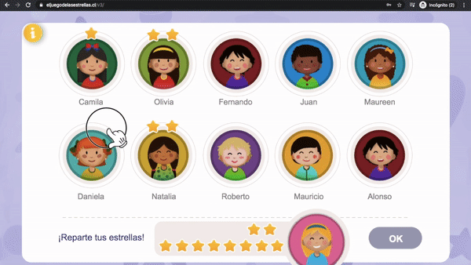
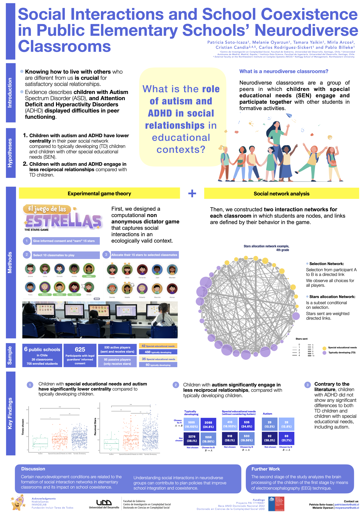

Soto-Icaza, P., Oyarzún, M., Yaikin, T., Arcos-Polanco, M., Candia, C., Rodríguez-Sickert, C., & Billeke, P. (2025). Autism shapes social integration and reciprocity in elementary classrooms. <em>Scientific Reports</em>, 15, 40473. <a href="https://doi.org/10.1038/s41598-025-24190-6">https://doi.org/10.1038/s41598-025-24190-6</a>

---

Pregunta clave

¿Qué papel juegan el autismo y otras necesidades educativas especiales en las relaciones sociales de niños y niñas dentro del aula?

En breve
Usamos <em>El juego de las estrellas</em>, un juego conductual en tablets conectadas, para mapear redes sociales entre pares en 26 salas de clase chilenas. Los niños y niñas autistas aparecen como significativamente más periféricos y menos involucrados en relaciones recíprocas que sus compañeros, mientras que estudiantes con TDAH no muestran diferencias significativas.

Por qué importa

La inclusión escolar suele medirse por asistencia o matrícula, no por si los niños y niñas están realmente entretejidos en la trama social de su curso. Este estudio entrega una medida conductual y ecológicamente válida de integración social, capaz de revelar desigualdades fuertes que permanecen invisibles en evaluaciones más convencionales, y apunta a la necesidad de repensar cómo diseñamos aulas inclusivas.

  

    

      
<strong>Experiencia complementaria: sitio scrollytelling</strong>

      
Una versión bilingüe, más visual, del paper, con una red explorable y los principales resultados presentados de forma narrativa.

    

    

      <a href="https://autism-storytelling.netlify.app/" target="_blank" rel="noopener" class="paper-story-button">
        Abrir historia
      </a>
    

  

  

    
Ver aquí >>

    

      <iframe
        src="https://autism-storytelling.netlify.app/"
        title="Historia interactiva para El autismo moldea la integración social y la reciprocidad en salas de clase de educación básica"
        loading="lazy"
        referrerpolicy="strict-origin-when-cross-origin">
      </iframe>
    

    
Si la vista previa no carga, abre la historia en una pestaña nueva.

  

---

## Resumen

Durante la infancia, la escuela es un entorno crucial para la interacción social, por lo que constituye un lugar especialmente adecuado para evaluar la inclusión de estudiantes con necesidades educativas especiales. En particular, niños y niñas autistas suelen enfrentar desafíos en sus relaciones con pares, pero el impacto del autismo sobre la dinámica social escolar todavía no está bien comprendido. Para abordar este problema examinamos dinámicas sociales dentro de escuelas básicas mediante un enfoque ecológico novedoso, basado en teoría de juegos experimental, para cuantificar integración social y reciprocidad entre estudiantes autistas.

Construimos redes sociales para cada sala de clase a partir de las elecciones hechas por los niños durante un juego distributivo jugado en tablets con una interfaz amigable. Participaron seis escuelas básicas y 625 estudiantes de entre 6 y 11 años. Entre ellos, 464 no tenían necesidades educativas especiales, 143 tenían necesidades educativas especiales distintas del autismo y 18 eran estudiantes autistas.

Nuestros análisis muestran que los niños y niñas autistas, así como quienes tenían otras necesidades educativas especiales, eran significativamente menos centrales y estaban menos involucrados en relaciones recíprocas que estudiantes sin necesidades educativas especiales. Estos resultados subrayan la necesidad de apoyo para promover inclusión social y, al mismo tiempo, remarcan la importancia de estudiar la intersección entre condiciones del neurodesarrollo y dinámica social.

---

## Cómo funciona el estudio

### Paso 1 — El juego: *El juego de las estrellas*

La mayoría de los estudios sobre relaciones entre pares se basa en preguntar a niños y niñas a quiénes consideran sus amigos. El problema es que no siempre dicen lo que realmente hacen, especialmente cuando se trata de a quiénes incluyen o excluyen. Nosotros hicimos algo distinto: en lugar de preguntar, *observamos*.

Cada estudiante jugó un juego breve en una tablet desde su pupitre. Toda la sala participó al mismo tiempo y, crucialmente, todos sabían quiénes estaban jugando, de manera que las decisiones tenían un peso social real.

El juego de las estrellas corriendo en tablets dentro de la sala en tiempo real.



---

### Paso 2 — Mapear quién se conecta con quién

A partir de las elecciones de cada estudiante construimos un **mapa de red social** del aula, esencialmente un diagrama que muestra quién entrega atención y recursos a quién. Registramos dos tipos de vínculo:

🔗 Red de selección

Quién eligió jugar con quién. Una flecha desde A hacia B significa que A incluyó a B en su juego. Esto muestra quién está en el radar social de cada niño o niña. Incluso quienes nadie eligió aparecen en esta red, haciendo visible la exclusión.

⭐ Red de asignación de estrellas

Quién envió estrellas a quién y cuántas. Esto captura intensidad: un estudiante que recibe muchas estrellas de muchos compañeros, es decir, alta in-strength, tiene alta valoración social; quien recibe pocas, o solo de una o dos personas, se encuentra en una posición más frágil.

{{< figure src="examplenet.png" alt="Interfaz del juego y ejemplo de red de aula con grupos ASD/SEN/noSEN" caption="Ejemplo de red de sala de clases del estudio. Cada punto es un niño o niña: turquesa = autismo (ASD), naranjo = otras necesidades educativas especiales (SEN), morado = sin SEN. Los puntos más grandes recibieron más estrellas; las líneas más gruesas indican un mayor número de estrellas enviadas. Los estudiantes autistas, en turquesa, se observan más pequeños y más cerca de los bordes." class="paper-figure" >}}

---

### Paso 3 — ¿El juego mide realmente lo que debería medir?

Antes de sacar conclusiones, verificamos si el juego estaba capturando dinámicas sociales reales o solo conducta aleatoria. Comparamos el puntaje obtenido por cada estudiante en el juego con encuestas tradicionales entre pares, donde por separado calificaban con quién les gustaría pasar tiempo, a quién evitarían y a quién consideran su amigo o amiga.



Los estudiantes que recibían más estrellas en el juego, es decir, mayor centralidad in-strength, eran consistentemente los mismos que sus compañeros nombraban como amigos en la encuesta. Y quienes recibían pocas estrellas eran más propensos a aparecer como personas a evitar. La medida conductual sigue de cerca dinámicas sociales reales.

---

## Hallazgos principales

### Hallazgo 1 — Los niños y niñas autistas son más periféricos en las redes del aula

La pregunta más básica es cuán seguido sus compañeros eligen incluir a un estudiante autista. Lo medimos de dos maneras: cuántos pares lo seleccionan, independientemente de las estrellas, es decir, *in-degree*, y cuántas estrellas recibe en total, es decir, *in-strength*. Ambas son medidas de centralidad social y ambas cuentan la misma historia.

{{< figure src="fig4_centralitysd.png" alt="Diagramas de caja de centralidad in-degree e in-strength por grupo: ASD, SEN (sin ASD), sin SEN" caption="Con qué frecuencia fue elegido cada grupo, in-degree a la izquierda, y cuántas estrellas recibió, in-strength a la derecha, ambos expresados como puntajes estandarizados relativos al promedio del curso. Un valor 0 significa promedio; valores negativos indican estar por debajo del promedio. Los estudiantes autistas, en turquesa, se agrupan claramente por debajo de cero en ambas medidas." class="paper-figure" >}}

Los niños y niñas autistas obtienen alrededor de **0.5 a 0.7 desviaciones estándar por debajo** del promedio del curso en ambas medidas, una brecha sustantiva y estadísticamente significativa (p = 0.0025 y p = 0.0026 frente a estudiantes sin necesidades educativas especiales). En términos prácticos: en una sala típica, un niño o niña autista probablemente será elegido por menos pares y recibirá menos estrellas que la mayoría de sus compañeros.

Los estudiantes con otras necesidades educativas especiales también aparecen por debajo del promedio, aunque la brecha es menor y menos consistente. El efecto más marcado se concentra en autismo.

---

### Hallazgo 2 — Las estrellas que reciben los niños y niñas autistas provienen de menos pares

Más allá de cuántas estrellas recibe una persona, también analizamos qué tan distribuidas están entre los distintos compañeros, una medida de concentración conocida como coeficiente de Gini. Un estudiante con conexiones sociales diversas suele recibir pequeñas cantidades de muchas personas; uno en una posición más frágil recibe pocas estrellas y concentradas en uno o dos vínculos.

{{< figure src="fig5_gini.png" alt="Coeficiente de Gini por grupo y tabla de regresión" caption="El coeficiente de Gini (0 = estrellas repartidas de forma uniforme entre pares; 1 = todas las estrellas provienen de una sola persona) mide cuán concentradas están las estrellas recibidas: valores más bajos implican apoyo social más amplio. Los estudiantes autistas muestran una reducción estadísticamente significativa de aproximadamente 0.04 puntos (β = −0.039, p = 0.036), lo que sugiere que el apoyo que reciben tiende a provenir de un círculo más estrecho." class="paper-figure" >}}

Aunque 0.04 puntos de Gini puede parecer un cambio pequeño en términos absolutos, refleja un patrón consistente: niños y niñas autistas no solo reciben menos estrellas en total, sino que las que reciben están menos distribuidas entre distintos pares, señal de una posición social más aislada.

---

### Hallazgo 3 — Las relaciones de niños y niñas autistas rara vez son mutuas

Una amistad cercana suele ser mutua: tú incluyes a alguien y esa persona te incluye de vuelta. Medimos con qué frecuencia ocurre eso en cada grupo a través de una propiedad llamada *reciprocidad*: una relación cuenta como recíproca cuando A elige a B *y* B también elige a A.



Este es probablemente el resultado más contundente: **las relaciones de niños y niñas autistas tienen aproximadamente la mitad de probabilidad de ser mutuas** en comparación con sus pares con desarrollo típico (12.8% vs. 24.3%). Cuando un estudiante autista elegía a un compañero, muchas veces ese compañero no lo elegía de vuelta. El problema no es solo tener menos vínculos, sino vínculos que tienden a ir en una sola dirección, un patrón que vuelve más difícil formar y sostener amistades significativas.

---

### Un resultado nulo sorprendente: TDAH

Un grupo que la literatura previa suele asociar con dificultades sociales es el de niños y niñas con TDAH. En contra de esa expectativa, encontramos **ninguna diferencia significativa** en centralidad o reciprocidad entre estudiantes con TDAH y estudiantes con desarrollo típico. Esto sugiere que los efectos de red observados aquí son específicos del autismo y no una característica general de todas las condiciones del neurodesarrollo, lo que motiva estrategias de apoyo e investigación más focalizadas.

---

## Póster de congreso

  🏆 Premio Best Poster
  European Conference on Social Networks (EUSN) · Londres, 2024

<a href="poster-eusn2024.jpeg" target="_blank" class="poster-link">
<figure class="paper-figure poster-figure">

<figcaption>Haz clic para abrir en tamaño completo.</figcaption>
</figure>
</a>

---

## Palabras clave

Redes sociales · Trastorno del espectro autista · Trastornos del neurodesarrollo · Educación inclusiva · Teoría de juegos experimental
