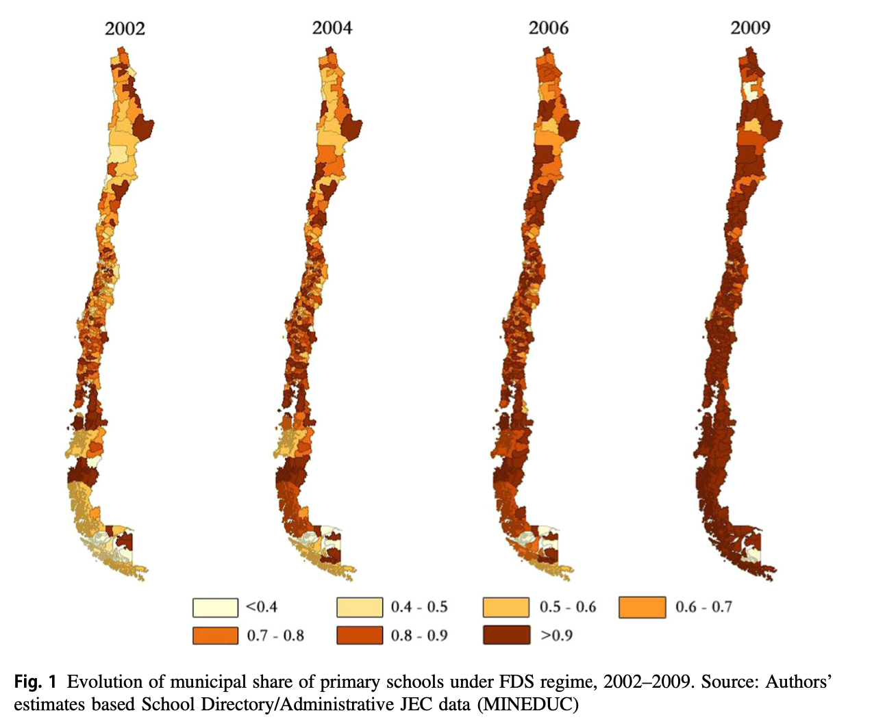

**Abstract**

Women's employment plays an important role in household well-being, and among mothers, lack of child care is one of the main reasons for not working and not seeking employment. We investigate the effect of a reform that lengthened school schedules from half to full days in Chile---providing childcare for school aged children---on different maternal employment outcomes. Using a panel of 2814 mothers over a 7-year period, we find evidence of important positive causal effects of access to full-day schools on mother's labor force participation, employment, weekly hours worked, and months worked during the year. We also find that lower-education and married mothers benefit most from the policy. Findings suggest that alleviating childcare needs can promote women's attachment to the labor force, increase household incomes and alleviate poverty and inequality.

