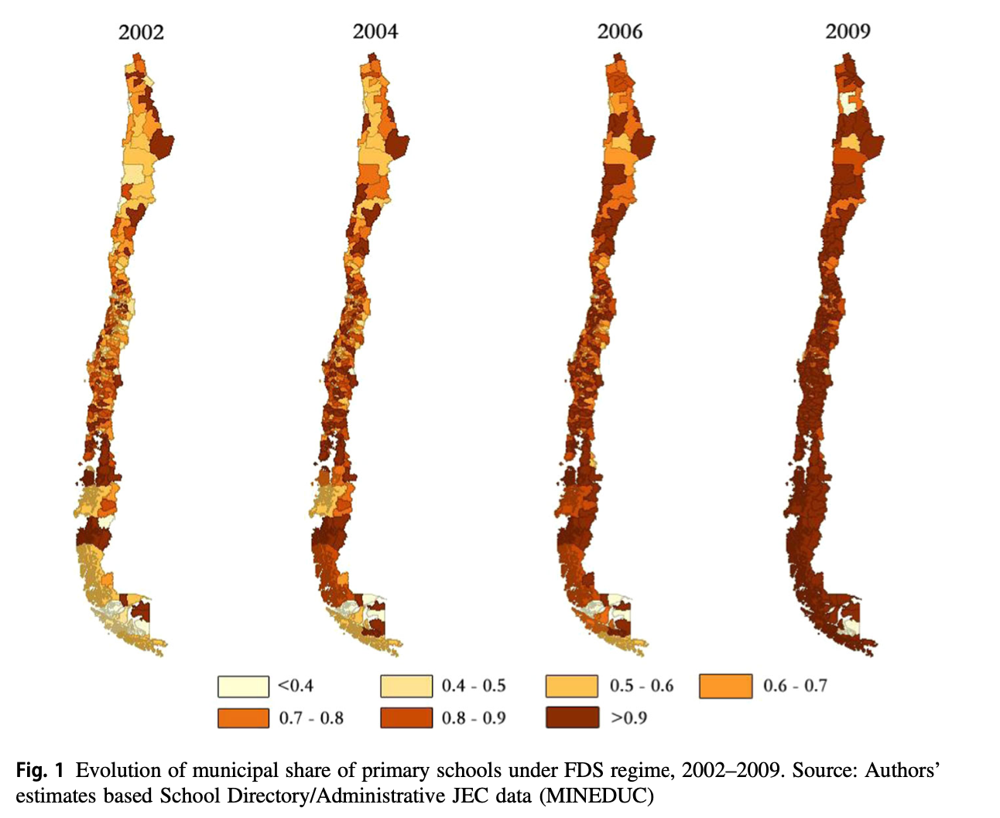

## Research question

What happens to mothers' labor outcomes when schools move from half-day to full-day schedules?

## Main contribution

Using panel data and quasi-experimental variation from an education reform in Chile, we find positive effects on labor force participation, employment, hours worked, and months worked.

## Published in

Review of Economics of the Household, 2023.

## Abstract

Women's employment plays an important role in household well-being, and among mothers, lack of child care is one of the main reasons for not working and not seeking employment. We investigate the effect of a reform that lengthened school schedules from half to full days in Chile---providing childcare for school aged children---on different maternal employment outcomes. Using a panel of 2814 mothers over a 7-year period, we find evidence of important positive causal effects of access to full-day schools on mother's labor force participation, employment, weekly hours worked, and months worked during the year. We also find that lower-education and married mothers benefit most from the policy. Findings suggest that alleviating childcare needs can promote women's attachment to the labor force, increase household incomes and alleviate poverty and inequality.

## Reproducibility

- Data source: survey/panel data (restricted access)
- Code release: available on request
- Replication package: to be added

## Storytelling

The policy story is direct: extending the school day changes the care constraints that shape mothers' labor decisions. This project links education policy design to household labor outcomes, showing how school-time infrastructure can alter inequality-relevant trajectories in work and income.

## Figure

