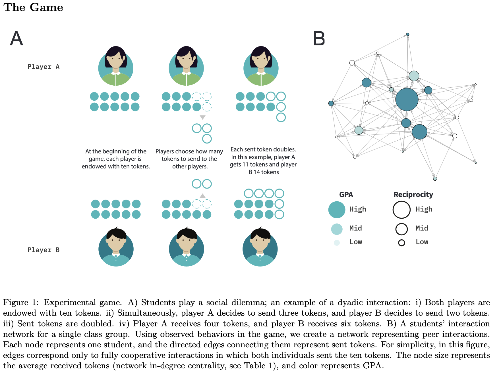

**Abstract**

Social relationships are pivotal for human beings. Yet, we still lack a complete understanding of the types and conditions of social relationships that facilitate learning among children. Here, we present the results of a study involving 855 elementary school children from 14 different public schools in Chile designed to understand their social learning strategies in classrooms. We mapped students’ social relationships using a behavioral experiment–a non-anonymous social dilemma–that allows us to measure cooperation and infer reciprocal and asymmetrical relationships between peers. We implemented the experiment synchronously in each classroom using networked tablets and a friendly user interface to mitigate cognitive barriers and boost students’ engagement. Using regression models, we found a positive and significant association between reciprocity and academic performance. This result holds after controlling for class attendance, sex, parents’ education, social status, individual cooperative dispositions, and fixed effects per class group. Finally, using a difference-in-difference framework, we found robust evidence that reciprocity heightens academic performance by comparing two consecutive academic semesters. This effect is heterogeneous and is considerably more prominent for the top 20% students experiencing higher levels of reciprocity in their social relationships. We expect these results to inform cooperative learning interventions in elementary education.

