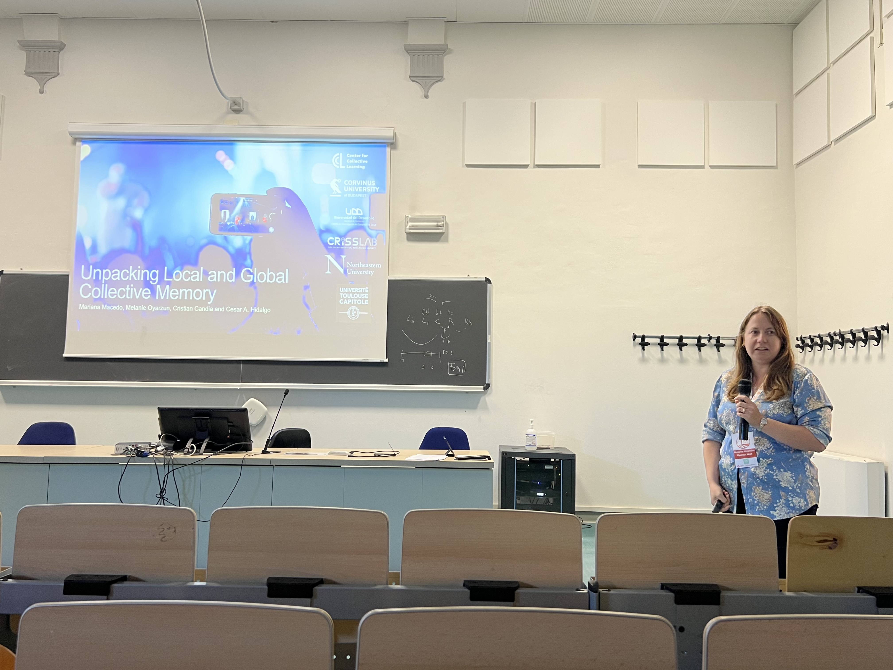
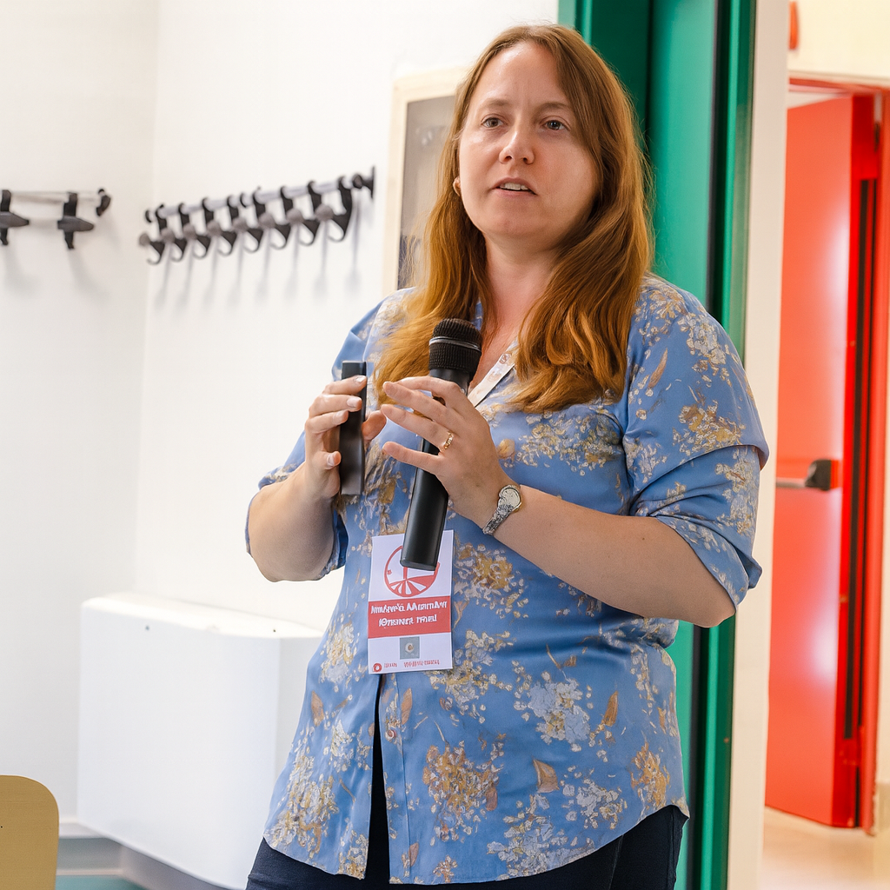
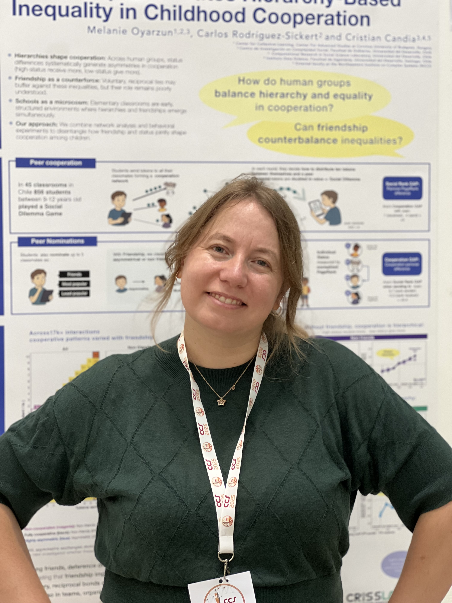
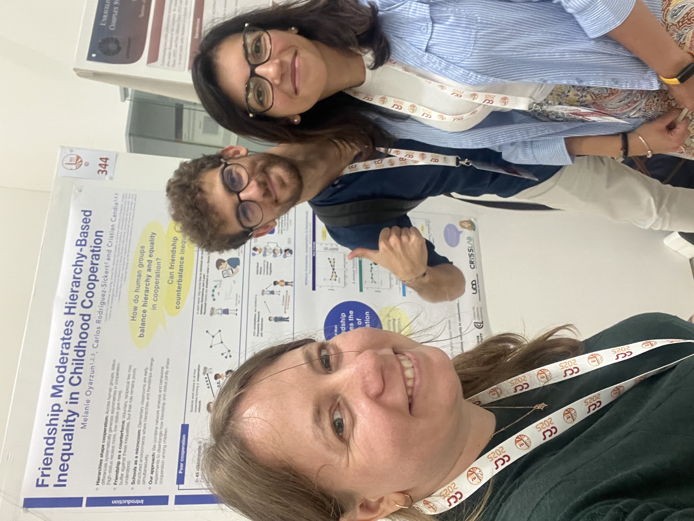
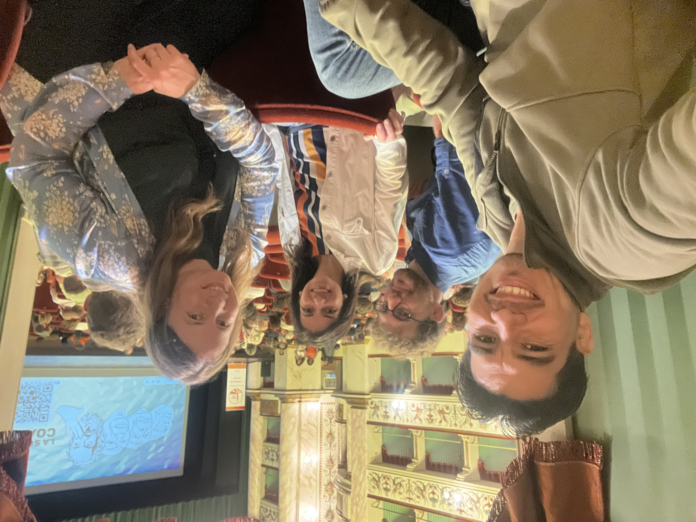

En CCS 2025 participé con dos trabajos: una presentación sobre **memoria colectiva local y global** y un póster sobre **desigualdad basada en amistades en la cooperación infantil**.

Me gusta que ambos tipos de participación queden registrados en un mismo lugar, porque los congresos muchas veces funcionan como hitos para varios proyectos al mismo tiempo. Con el tiempo esta página puede crecer hasta convertirse en un registro más rico, con diapositivas, imágenes del póster, fotos y breves ideas clave.

## Fotos

  <figure>
    
    <figcaption>Presentando en Siena.</figcaption>
  </figure>
  <figure>
    
    <figcaption>Un retrato de la conferencia.</figcaption>
  </figure>
  <figure>
    
    <figcaption>Con el póster durante la conferencia.</figcaption>
  </figure>
  <figure>
    
    <figcaption>Un momento de congreso con colaboradores.</figcaption>
  </figure>
  <figure>
    
    <figcaption>Uno de esos momentos informales que también vuelven memorables a los congresos.</figcaption>
  </figure>

