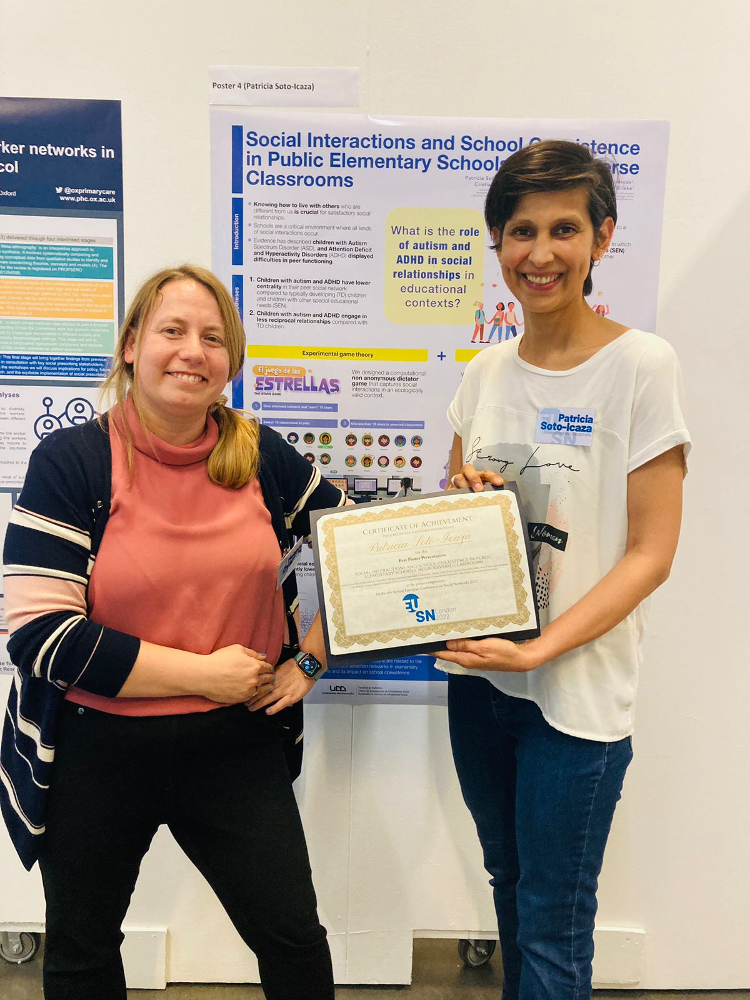

En la European Conference on Social Networks presenté un póster sobre **interacciones sociales y convivencia escolar en aulas neurodiversas de educación básica**. Este trabajo más tarde alimentó una línea de investigación más amplia sobre integración social, reciprocidad y estructura de redes en el aula.

El evento fue especialmente significativo porque el póster recibió el premio **Best Poster**. Me gustaría que esta página terminara guardando la imagen del póster, una breve explicación del proyecto y notas que después puedan convertirse en un post de LinkedIn o un resumen público.

## Foto

  <figure>
    
    <figcaption>Recibiendo la distinción Best Poster en Londres.</figcaption>
  </figure>

