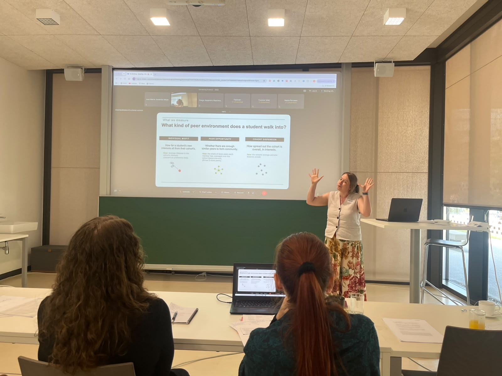
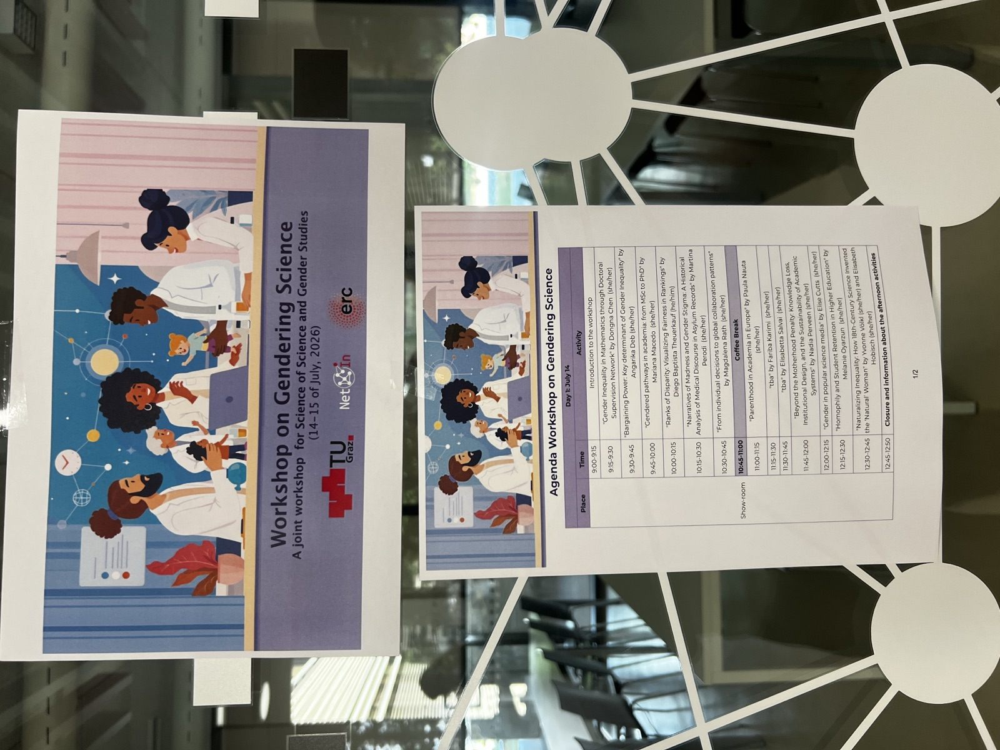
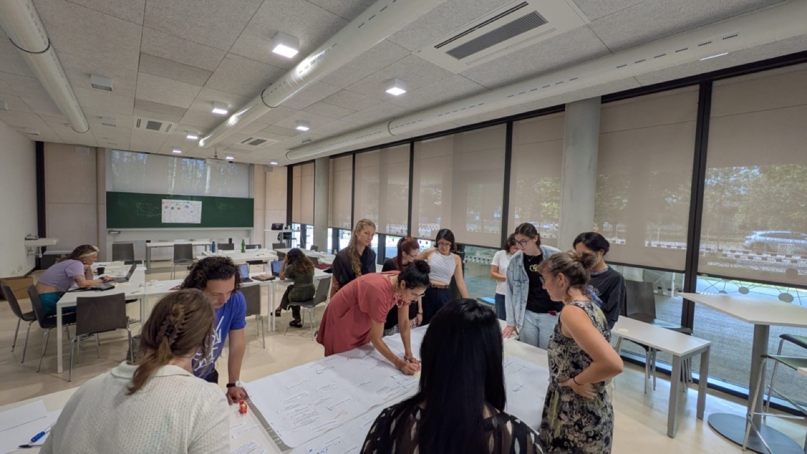
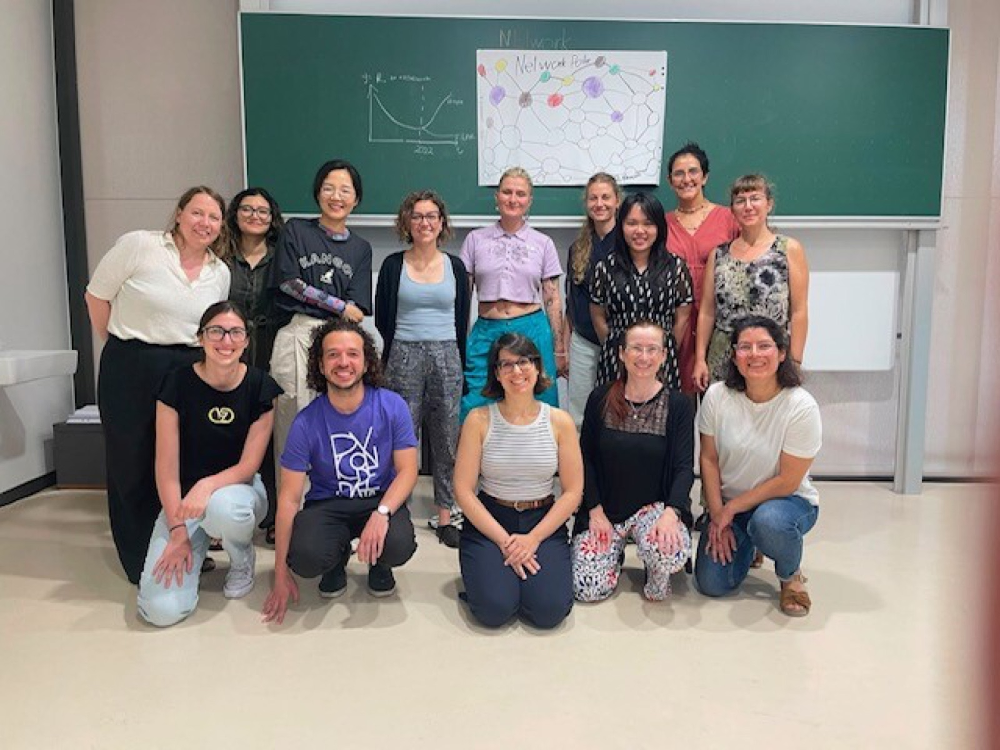
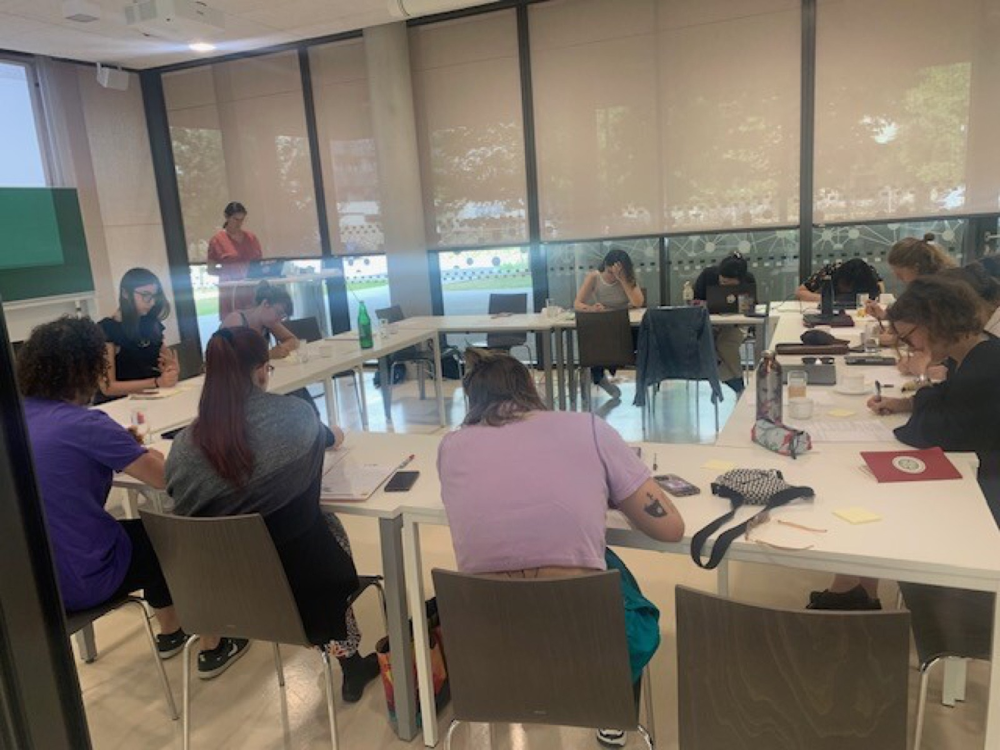
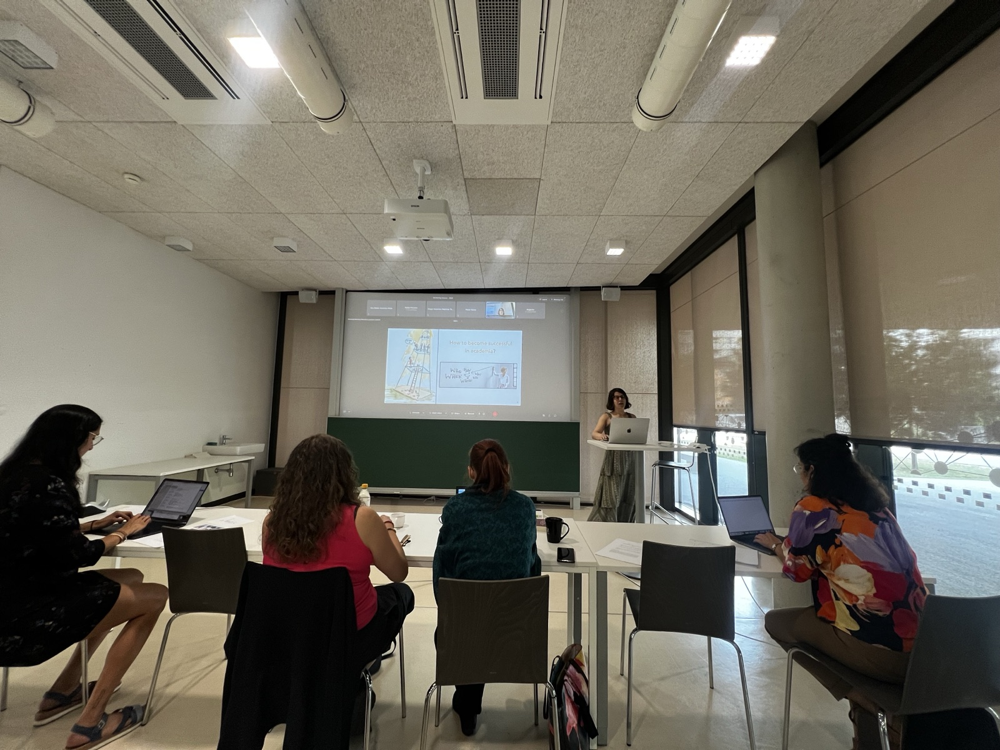
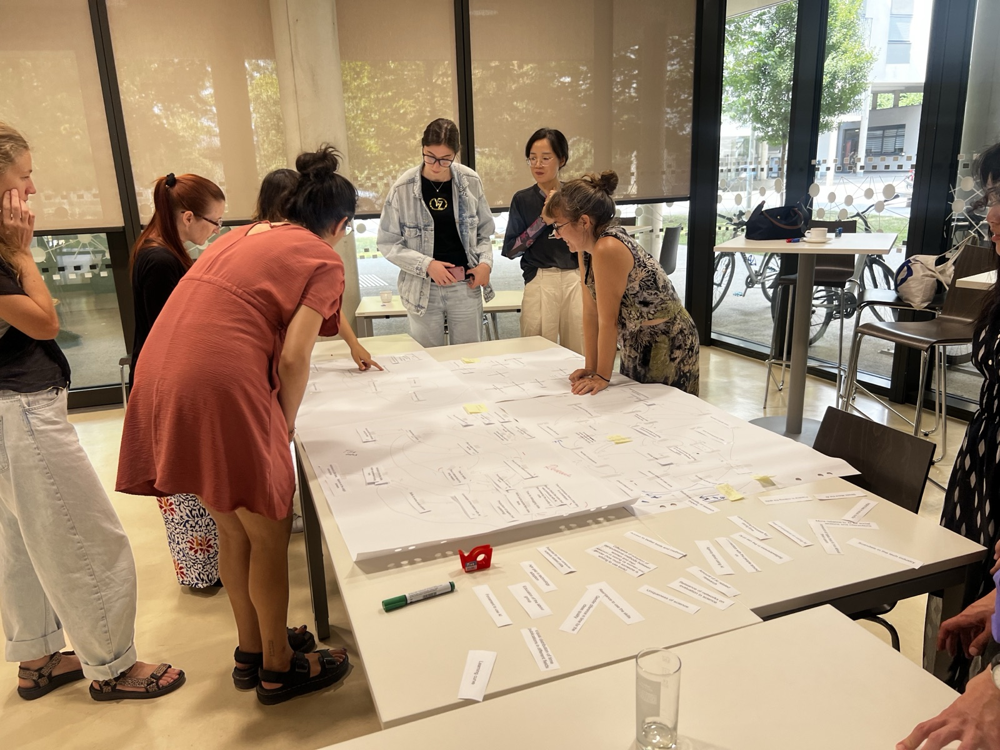
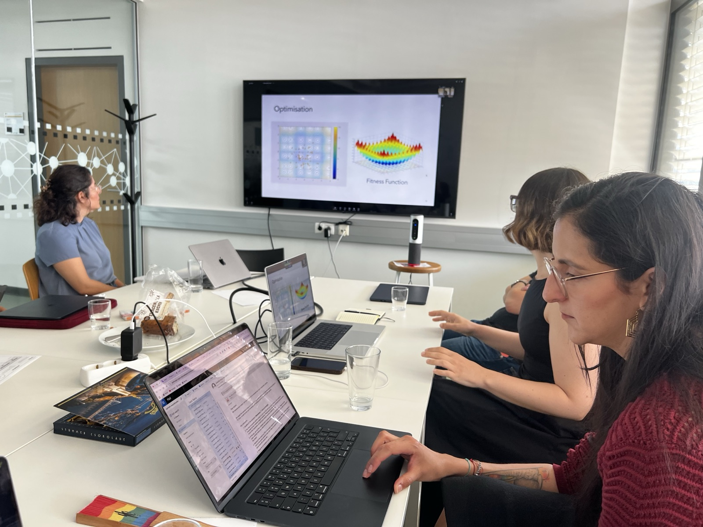

El **Gendering in Science Workshop** en **TU Graz** fue un workshop pequeño que quería documentar porque abrió espacio para conversaciones que muchas veces quedan dispersas entre campos: science of science, estudios de género, trayectorias académicas, redes de colaboración y la era de la IA.

El workshop reunió trabajos sobre desigualdades estructurales en STEM, trayectorias académicas, redes de colaboración y la era de la IA. Fue un buen espacio para este proyecto porque la retención puede entenderse no solo como una decisión individual, sino también como un proceso relacional moldeado por la composición de la cohorte y las oportunidades para encontrar puntos en común.

Durante el segundo día, las y los participantes mapearon desafíos y posibles puntos de intervención para la desigualdad en ciencia. Me gustó esa parte del workshop porque conectó investigación empírica con preguntas más amplias sobre pérdida de talento, inclusión y cómo se construyen las herramientas científicas.

## Qué presenté

**Heterogeneity and Homophily in the Academic Retention of STEM Students** 
Presentación oral · Gendering in Science Workshop · TU Graz · Graz, Austria

<figure>
  
  <figcaption>Presentando el proyecto sobre retención de estudiantes en el workshop.</figcaption>
</figure>

La presentación se centró en cómo los entornos de pares al ingreso universitario pueden moldear la persistencia en educación superior. El proyecto mide qué tan bien encajan los estudiantes dentro de sus cohortes de entrada, usando dimensiones como intereses, atributos demográficos y antecedentes educacionales o geográficos, y pregunta si esas primeras formas de similitud y heterogeneidad se asocian con retención y deserción.

## El workshop

  <figure>
    
    <figcaption>Afiche y agenda del workshop en TU Graz.</figcaption>
  </figure>
  <figure>
    
    <figcaption>Actividad colaborativa del workshop en TU Graz.</figcaption>
  </figure>
  <figure>
    
    <figcaption>Foto grupal del workshop.</figcaption>
  </figure>
  <figure>
    
    <figcaption>Discusión y trabajo grupal del workshop.</figcaption>
  </figure>
  <figure>
    
    <figcaption>Mi amiga y colaboradora Mariana Macedo presentando su trabajo.</figcaption>
  </figure>
  <figure>
    
    <figcaption>Actividad de mapeo colaborativo.</figcaption>
  </figure>

<figure>
  
  <figcaption>Después del workshop, Mariana y yo fuimos invitadas a presentar nuestro trabajo con el grupo de Fariba Karimi en TU Graz.</figcaption>
</figure>
