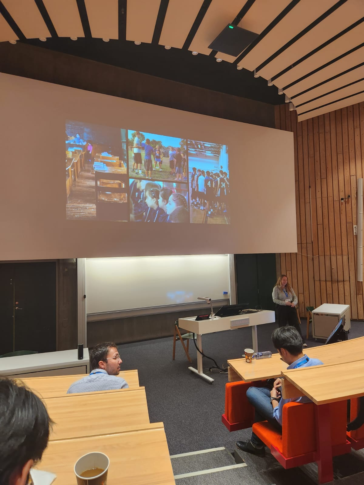
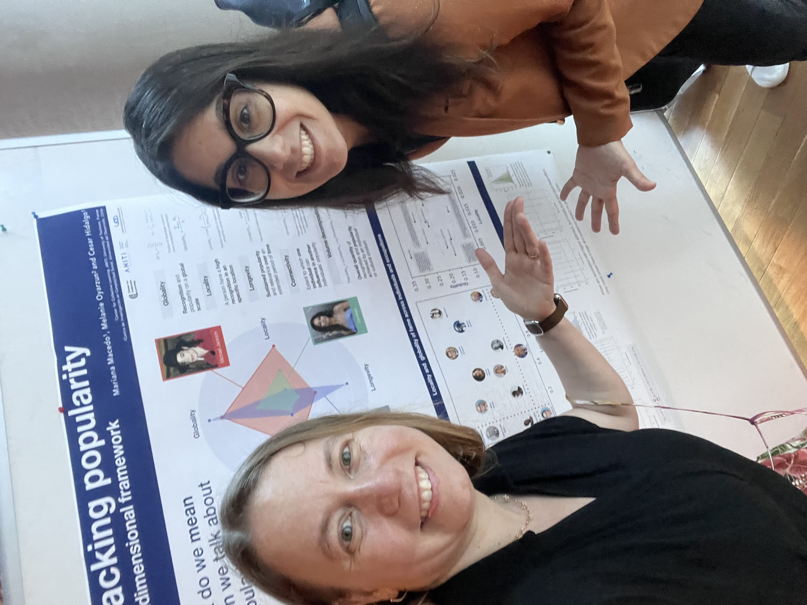

At IC2S2 2023 I presented **Friendship modulates hierarchical relations in public elementary schools**. This project sits at the intersection of childhood inequality, cooperation, and social network structure, and the conference gave it a strong computational social science audience.

This is also the kind of page I want to keep building over time: not just finished papers, but the research path itself through conferences, presentations, and collaborations.

## Photos

  <figure>
    
    <figcaption>A moment from IC2S2 2023 in Copenhagen.</figcaption>
  </figure>
  <figure>
    
    <figcaption>With coauthor Mariana Macedo in Copenhagen.</figcaption>
  </figure>

