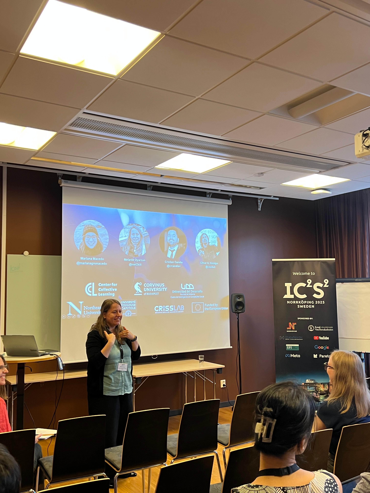
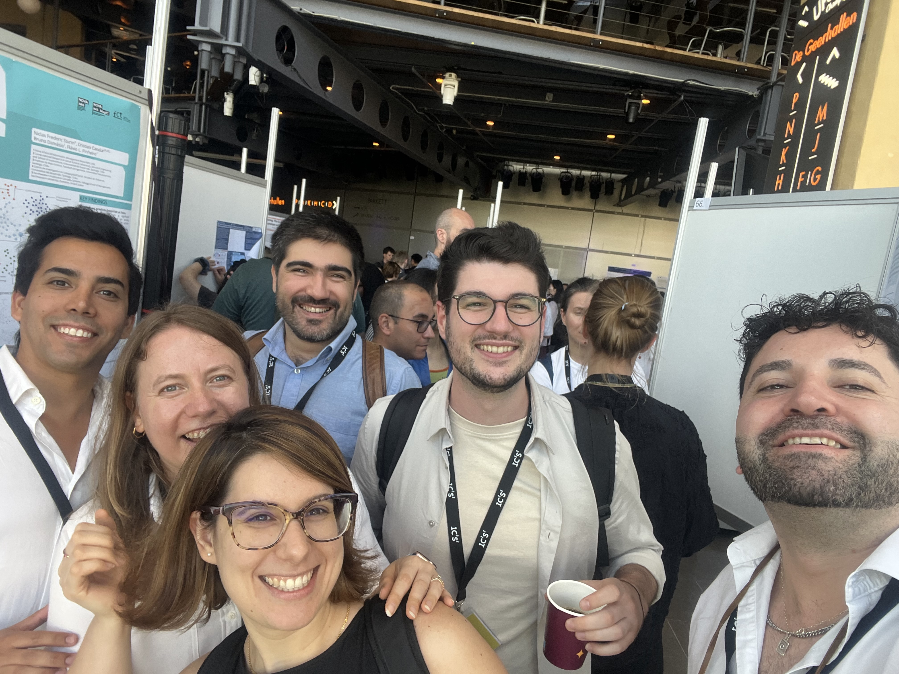
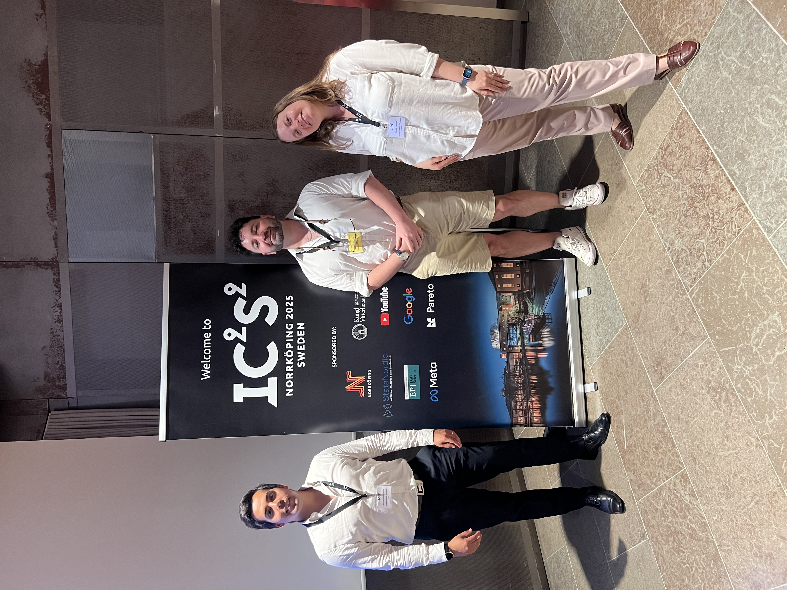

At IC2S2 2025 I presented **Unpacking Local and Global Collective Memory**, a project connected to collective memory, cultural proximity, and large-scale social data.

This is exactly the kind of event I want to register better on the website: it creates a trail of projects in motion, not only finished papers. It also gives me a place to later attach slides, photos, or a short reflection that can be adapted into a broader public-facing post.

## Photos

  <figure>
    
    <figcaption>Presenting in Norrkoping.</figcaption>
  </figure>
  <figure>
    
    <figcaption>One of the many good moments of the conference with collaborators and colleagues.</figcaption>
  </figure>
  <figure>
    
    <figcaption>Another snapshot from IC2S2 2025.</figcaption>
  </figure>

