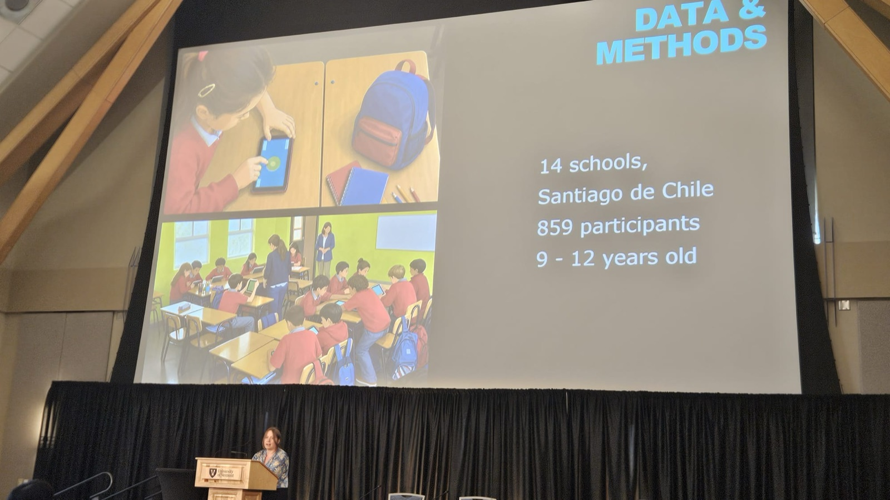
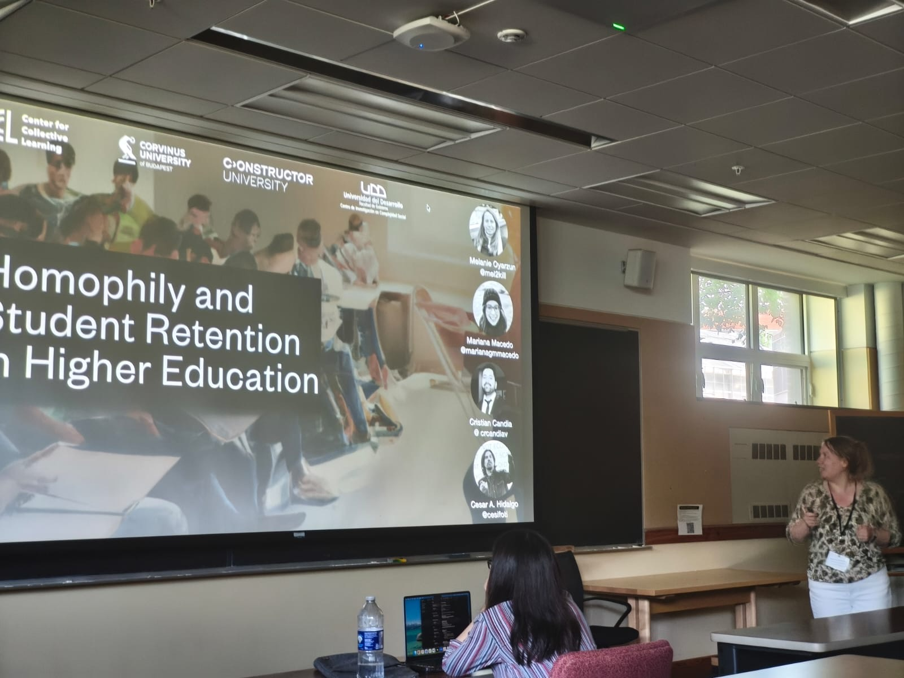
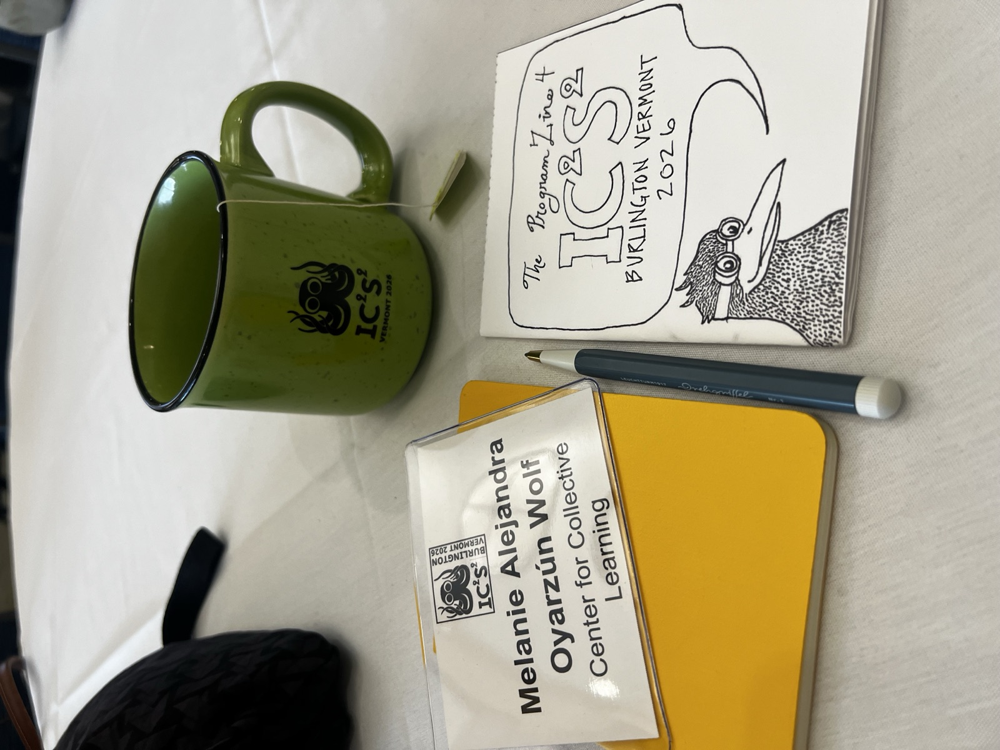
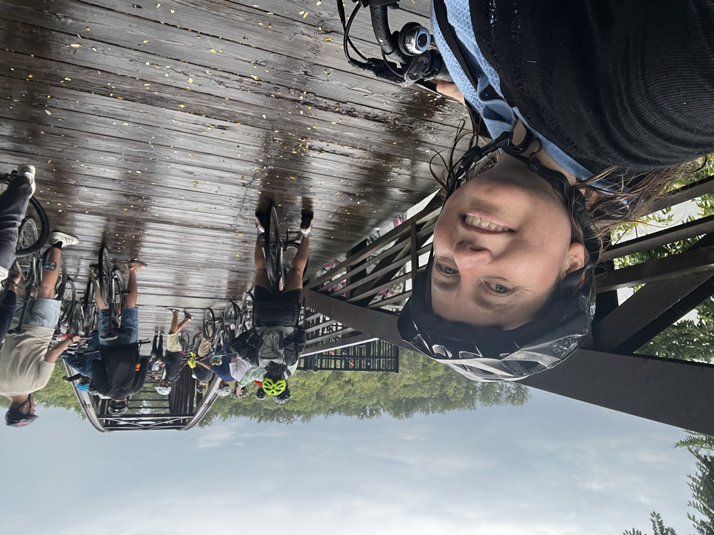
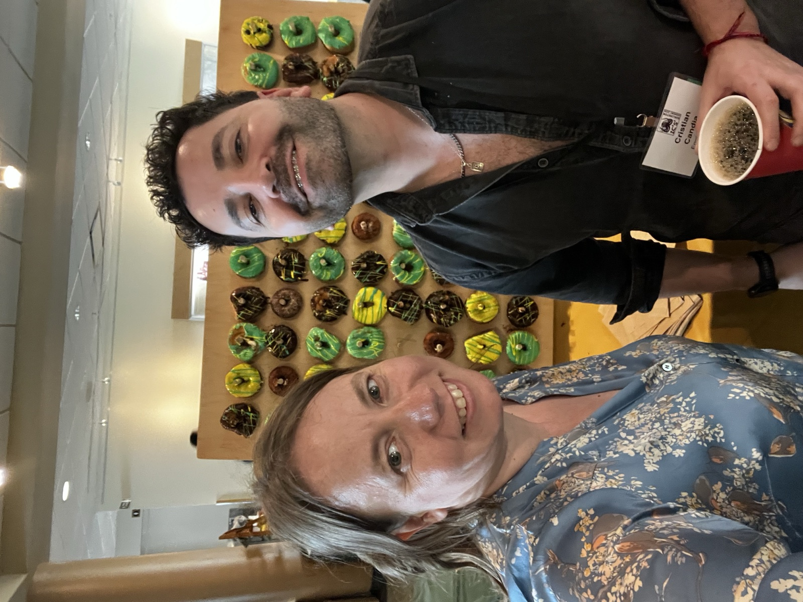
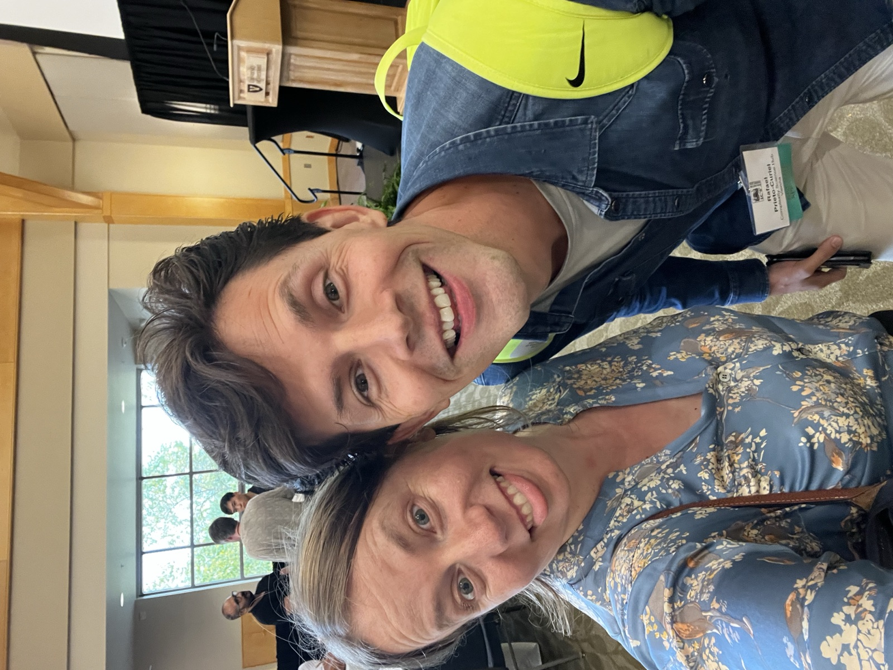
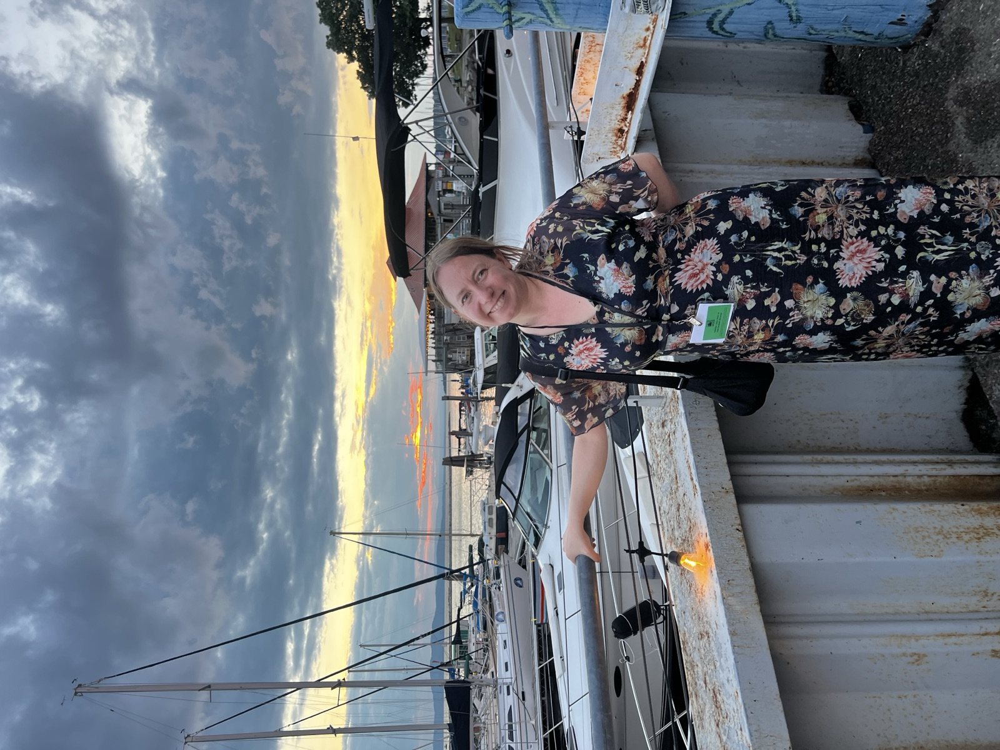
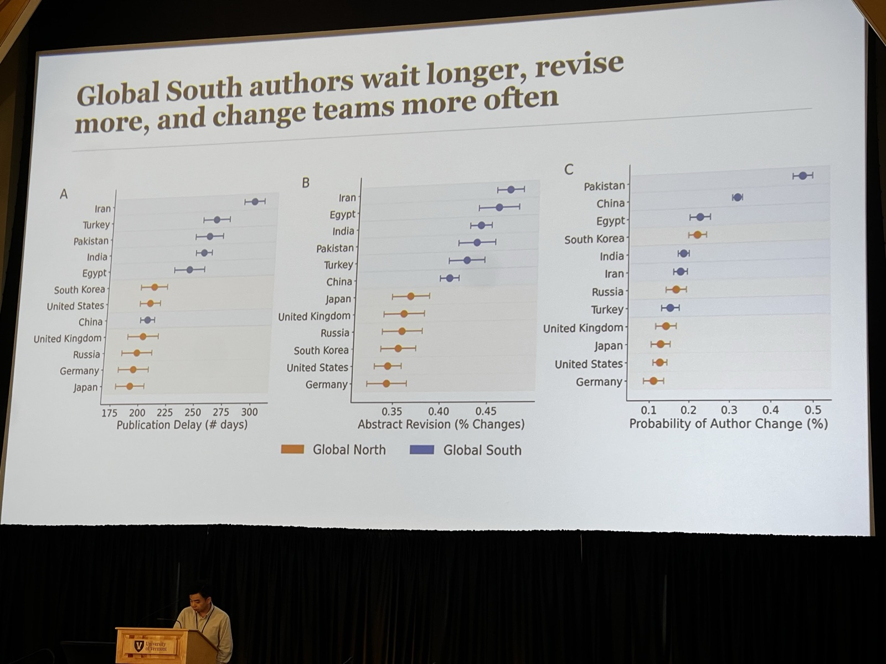

IC2S2 2026 was one of those conference weeks that sat right at the intersection of the things I like most about computational social science: sharp methods, generous conversations, and the chance to see how different empirical worlds speak to each other.

In Burlington, I presented two projects connected by a common question: how social structure shapes opportunities, cooperation, and persistence.

The first was a lightning talk on **Friendship Modulates the Expression of Hierarchy in Cooperation**, a project about how status and friendship jointly structure cooperation among children in elementary school classrooms. Using a classroom-based behavioral experiment with token exchanges, we show that cooperation can follow hierarchical patterns, but that friendship - especially mutual recognition - can attenuate how those inequalities are expressed.

The second was an oral presentation on **Heterogeneity and Homophily in the Academic Retention of STEM Students**, a project about the early peer environment students encounter when they enter higher education. Using large-scale Chilean administrative data, it examines how individual fit with the entry cohort and cohort heterogeneity are associated with persistence and dropout, especially in STEM programs.

## What I Presented

**Friendship Modulates the Expression of Hierarchy in Cooperation** 
Lightning talk · IC2S2 2026 · Burlington, Vermont

<figure>
  
  <figcaption>Presenting the cooperation and hierarchy project at IC2S2 2026.</figcaption>
</figure>

**Heterogeneity and Homophily in the Academic Retention of STEM Students** 
Oral presentation · IC2S2 2026 · Burlington, Vermont

<figure>
  
  <figcaption>Presenting the STEM retention project in a contributed session at IC2S2 2026.</figcaption>
</figure>

## The Week in Burlington

  <figure>
    
    <figcaption>Conference badge and materials in Burlington.</figcaption>
  </figure>
  <figure>
    
    <figcaption>Bike ride after the tutorials.</figcaption>
  </figure>
  <figure>
    
    <figcaption>With my colleague Cristian Candia.</figcaption>
  </figure>
  <figure>
    
    <figcaption>With my friend Rafael Curio, also a keynote speaker in this edition.</figcaption>
  </figure>
  <figure>
    
    <figcaption>A photo from the gala dinner.</figcaption>
  </figure>
  <figure>
    
    <figcaption>Presentation session at IC2S2 2026.</figcaption>
  </figure>

