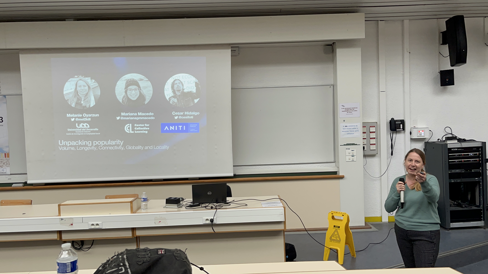

En la French Regional Conference on Complex Systems presenté **Unpacking popularity: volume, longevity, connectivity and globality**. Este trabajo formaba parte de una línea más amplia sobre memoria colectiva y dinámicas culturales, y me ayudó a afinar cómo enmarcar el proyecto para una audiencia interdisciplinaria de sistemas complejos.

También quiero que esta sección del sitio capture escalas de congreso más pequeñas pero igualmente significativas como esta, porque muchas veces marcan el momento en que las ideas se vuelven más claras y comunicables.

## Foto

  <figure>
    
    <figcaption>Una imagen de Le Havre durante la conferencia.</figcaption>
  </figure>

