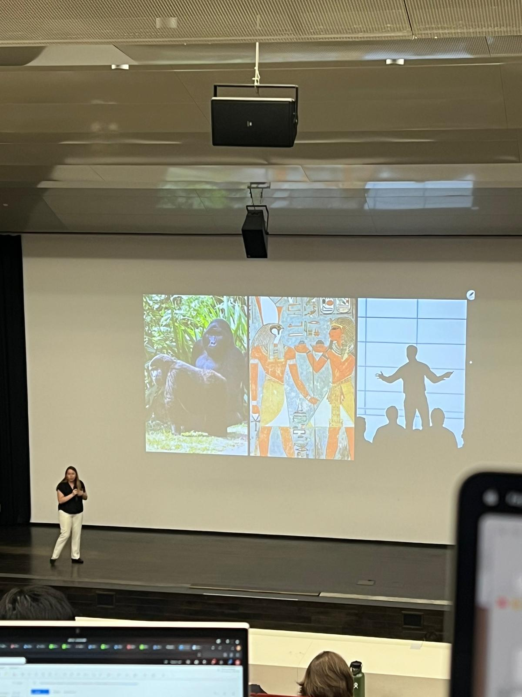
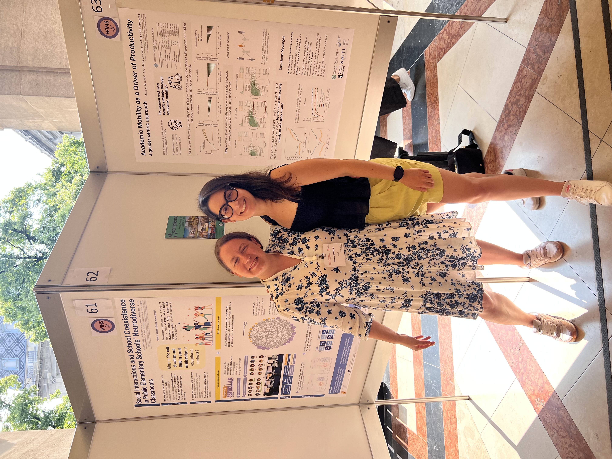
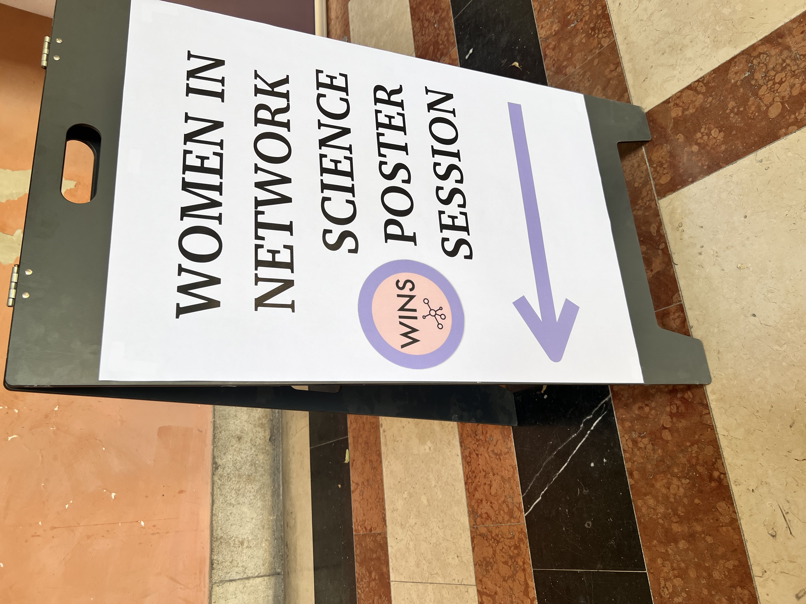
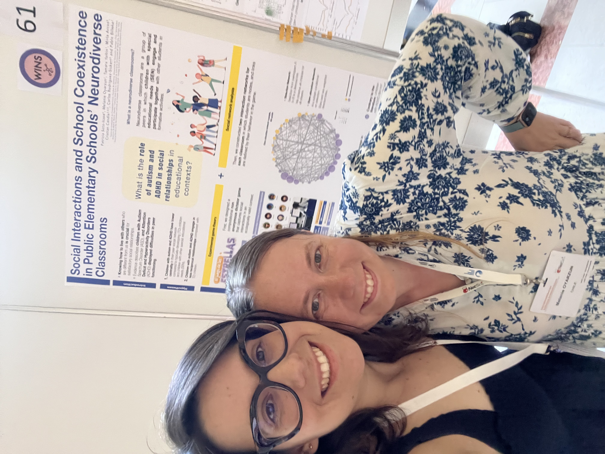

At NetSci 2023 I gave a lightning presentation on **friendship and hierarchical relations in public elementary schools**. This work sits at the intersection of social networks, cooperation, and inequality in childhood social environments.

The short format was especially useful for distilling the core contribution of the project into a compact narrative. It is also the kind of event I want to document better over time, because it can later feed into slides, short write-ups, and public communication.

## Photos

  <figure>
    
    <figcaption>Presenting the project in Vienna.</figcaption>
  </figure>
  <figure>
    
    <figcaption>During the poster session.</figcaption>
  </figure>
  <figure>
    
    <figcaption>A moment from the Women in Network Science activities at the conference.</figcaption>
  </figure>
  <figure>
    
    <figcaption>With collaborator and friend Mariana Macedo in Vienna.</figcaption>
  </figure>

