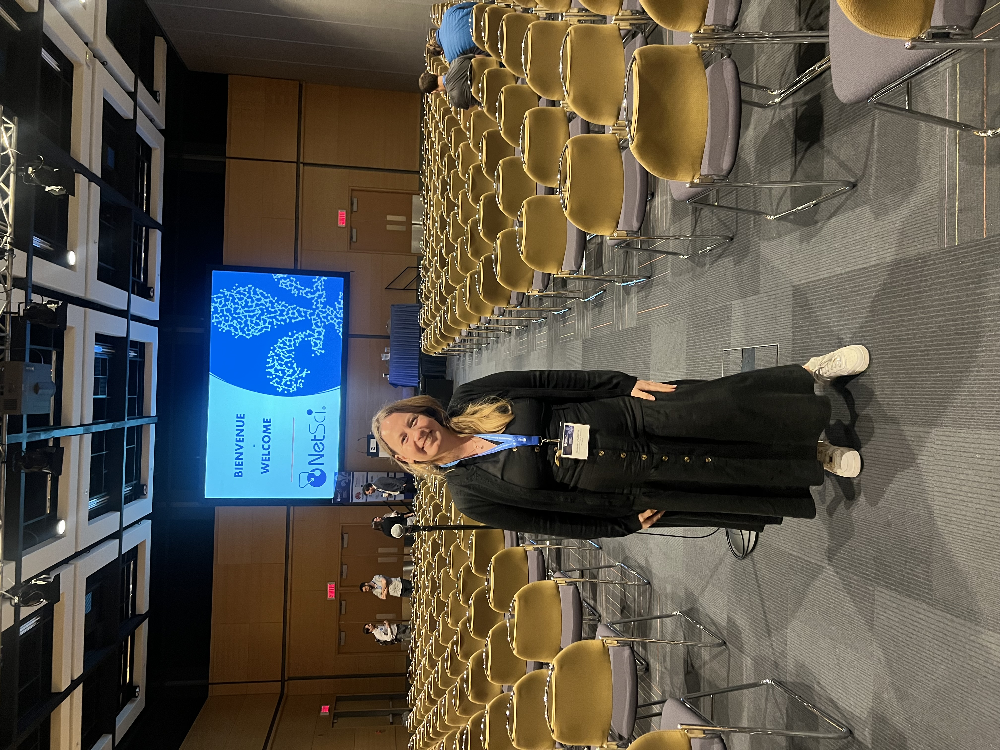
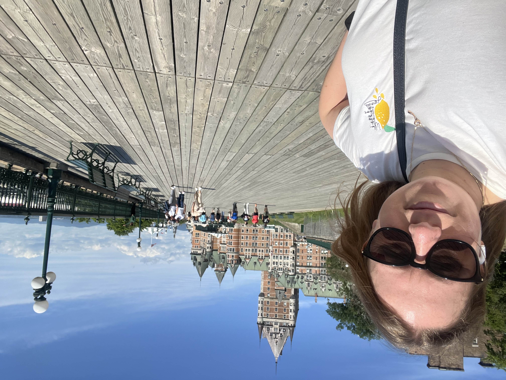

This conference presentation focused on work about **heterogeneity and homophily in the academic retention of STEM students**. It was part of an ongoing line of research connecting network structure, persistence, and inequality in higher education.

For me, this event was also useful as a checkpoint: it helped sharpen how to communicate the project to a broader network science audience, and it marked a transition toward framing the work more explicitly around persistence and social structure.

This page now starts doing exactly that: keeping a simple record of where the project was presented, what the core argument was, and some visual traces from the event.

## Photos

  <figure>
    
    <figcaption>A moment from NetSci 2024 in Quebec.</figcaption>
  </figure>
  <figure>
    
    <figcaption>Another snapshot from the conference in Quebec.</figcaption>
  </figure>

