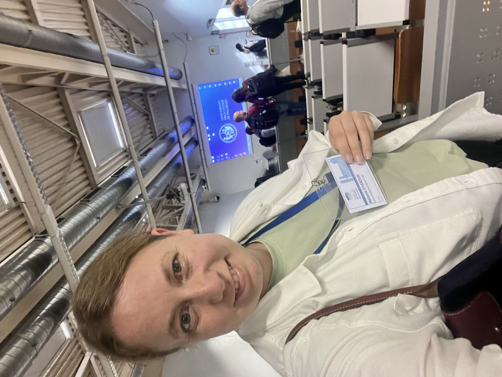

En la International Conference on Complex Networks en Palermo presenté **Friendship modulates hierarchical relations in public elementary schools**. Este proyecto ya empezaba a tomar forma como parte de mi trabajo sobre estructura social, cooperación y desigualdad en contextos escolares.

Páginas como esta ayudan a conservar la trayectoria de un proyecto a través de distintos espacios, en vez de mostrar solo su versión final publicada.

## Foto

  <figure>
    
    <figcaption>Un momento del congreso en Palermo.</figcaption>
  </figure>

