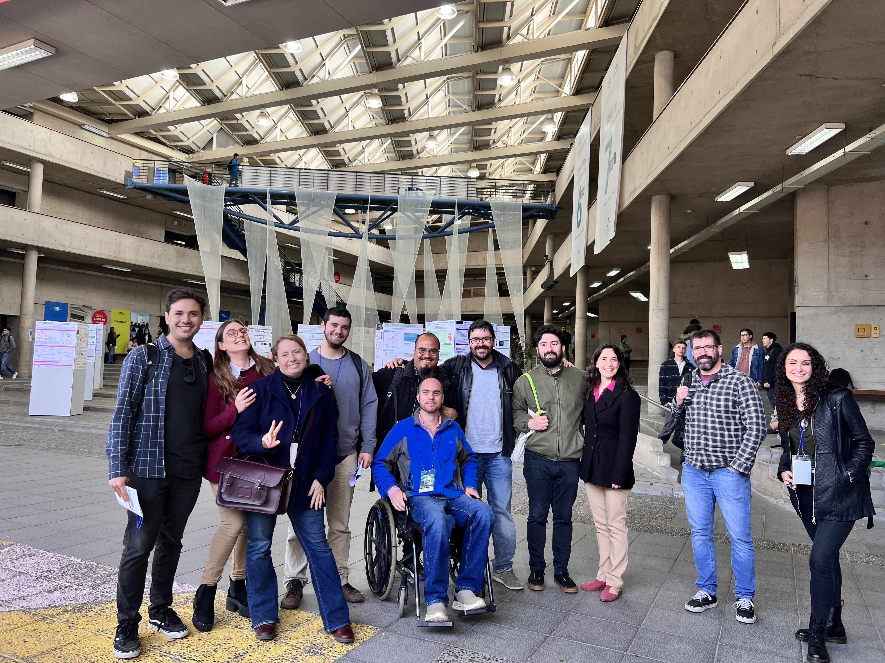
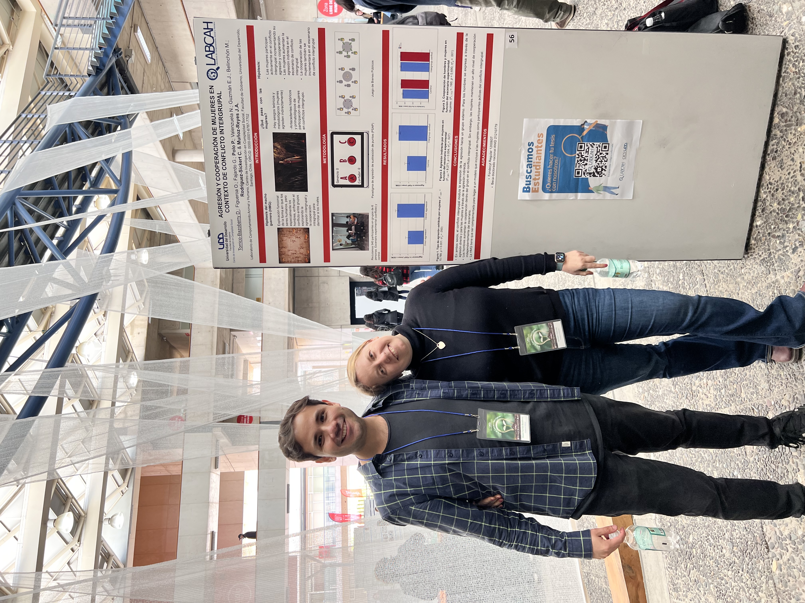

I also want this section to record events that sit outside the usual conference circuit. These photos are from the **UDD Science Fair in Santiago**, an opportunity to share research in a more open university setting and connect ongoing work with a broader audience.

That matters to me because academic communication is not only about formal conference presentations; it also includes teaching, outreach, and the more public-facing moments where ideas begin to travel.

## Photos

  <figure>
    
    <figcaption>One of the moments from the UDD Science Fair in Santiago.</figcaption>
  </figure>
  <figure>
    
    <figcaption>Another snapshot from the event.</figcaption>
  </figure>

