WiDS Budapest es uno de los eventos que más quería documentar con cuidado porque no solo asistí: ayudé a construirlo.

En 2025 integré el comité organizador y lideré el datathon de la primera **WiDS Budapest Datathon**, concebida como una extensión local del datathon global de WiDS. Mi rol abarcó esas partes de un evento que normalmente desaparecen detrás de una línea breve en el CV: diseñar el desafío, coordinar mentores, preparar materiales, pensar la experiencia de las personas participantes y ayudar a que la jornada se desarrollara de una forma técnicamente seria y genuinamente acogedora.

WiDS Worldwide describe sus datathones como espacios donde las personas pueden aprender, aplicar y fortalecer sus habilidades en ciencia de datos a través de desafíos con impacto social. En Budapest, esa misión tomó una forma local. Esta primera edición fue organizada por **WiDS Budapest, Corvinus University y Mastercard**, y se realizó en **Mastercard Offices, Vaci ut 26, Budapest** el **viernes 26 de septiembre de 2025, entre las 13:00 y las 20:00**.

Lo que hizo especialmente emocionante al evento fue el desafío mismo: aplicar IA a datos de neurociencia y salud mental para estudiar el cerebro femenino. La convocatoria fue intencionalmente amplia y acogedora. Las personas podían inscribirse individualmente o en equipos de hasta tres integrantes, no se requería experiencia previa y hubo mentores disponibles durante toda la jornada para ofrecer apoyo y retroalimentación. El evento recibió especialmente a participantes que se identifican como mujeres y enmarcó el día como un espacio para aprender, colaborar y crecer.

De lo que me siento especialmente orgullosa es de que el evento reunió varias cosas que me importan al mismo tiempo: la ciencia de datos como oficio práctico, la mentoría como apoyo real y no como branding, y la construcción de comunidad como parte del trabajo mismo. Para mí, esto no fue solo otra fecha en el calendario. Fue un ejemplo concreto del tipo de trabajo público con datos que quiero seguir haciendo.

## Highlights oficiales

También existe un video oficial de highlights del evento, publicado en YouTube por **WiDS Worldwide**, y quise dejarlo aquí como primer registro audiovisual del datathon.

  

    <iframe
      class="aspect-ratio--object"
      src="https://www.youtube.com/embed/cRvdG0h-R4c"
      title="Highlights de WiDS Budapest"
      loading="lazy"
      allow="accelerometer; autoplay; clipboard-write; encrypted-media; gyroscope; picture-in-picture; web-share"
      referrerpolicy="strict-origin-when-cross-origin"
      allowfullscreen>
    </iframe>
  

## La convocatoria

La invitación pública capturó muy bien el espíritu del evento: una primera WiDS Budapest Datathon, conectada con la comunidad más amplia de WiDS, pero sostenida por un esfuerzo organizativo local. Invitaba a las personas a llevar sus laptops y su curiosidad, trabajar en equipos pequeños y desarrollar habilidades en un entorno de apoyo mientras se conectaban con una red más amplia de mujeres en ciencia de datos.

También importaba que el evento tuviera una estructura y una ambición claras. Las postulaciones cerraron el **18 de septiembre de 2025**, la jornada incluyó premios pensados para reconocer a las participantes y ayudar a impulsar trayectorias en ciencia de datos, y el tono general del evento no era solo competitivo, sino también formativo.

## Antes del evento

  <figure>
    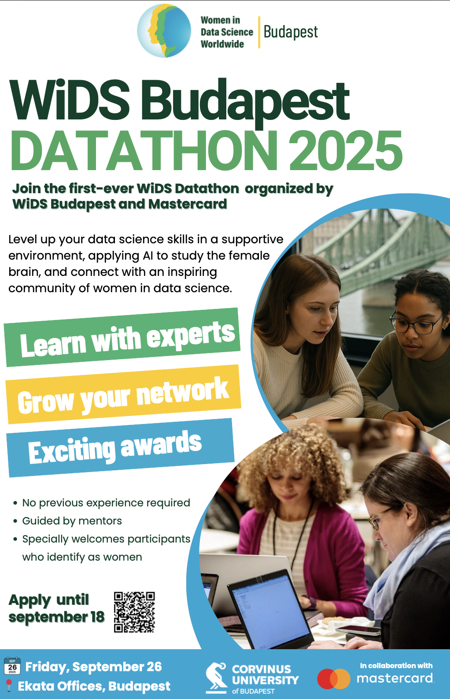
    <figcaption>El afiche promocional de la primera WiDS Budapest Datathon.</figcaption>
  </figure>
  <figure>
    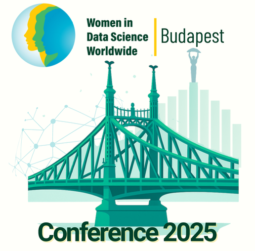
    <figcaption>La imagen oficial del evento, conectando el capítulo de Budapest con la identidad más amplia de WiDS.</figcaption>
  </figure>

Antes del evento hubo mucho trabajo invisible tras bambalinas: definir cómo debía sentirse el datathon, asegurarse de que el desafío fuera accesible pero significativo, coordinar personas y convertir una idea en algo que participantes pudieran habitar por un día. Quise guardar estos materiales aquí porque también forman parte de la historia, no son solo decoración alrededor del evento.

## El día mismo

  <figure>
    
    <figcaption>Una foto grupal que captura la energía colectiva de la jornada.</figcaption>
  </figure>
  <figure>
    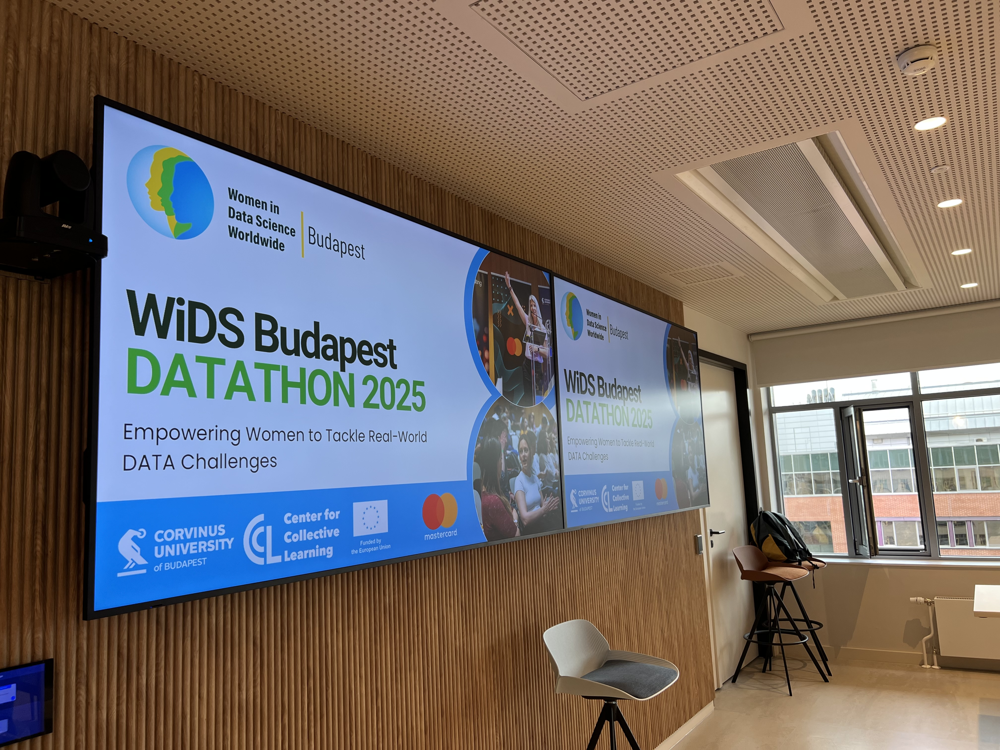
    <figcaption>La sala antes de que el día comenzara por completo, con las pantallas listas para el datathon.</figcaption>
  </figure>
  <figure>
    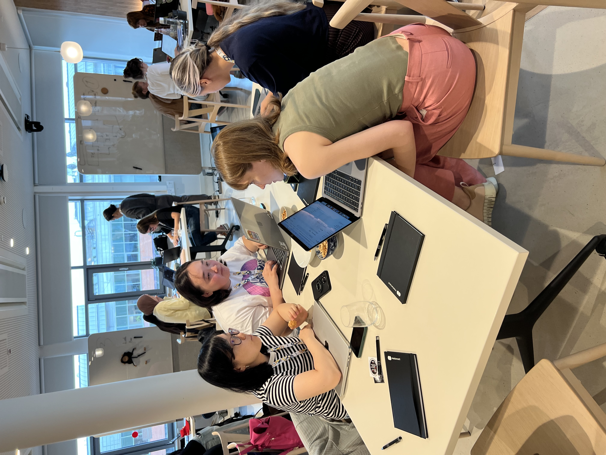
    <figcaption>Participantes instalándose en el desafío y comenzando a trabajar en equipos.</figcaption>
  </figure>
  <figure>
    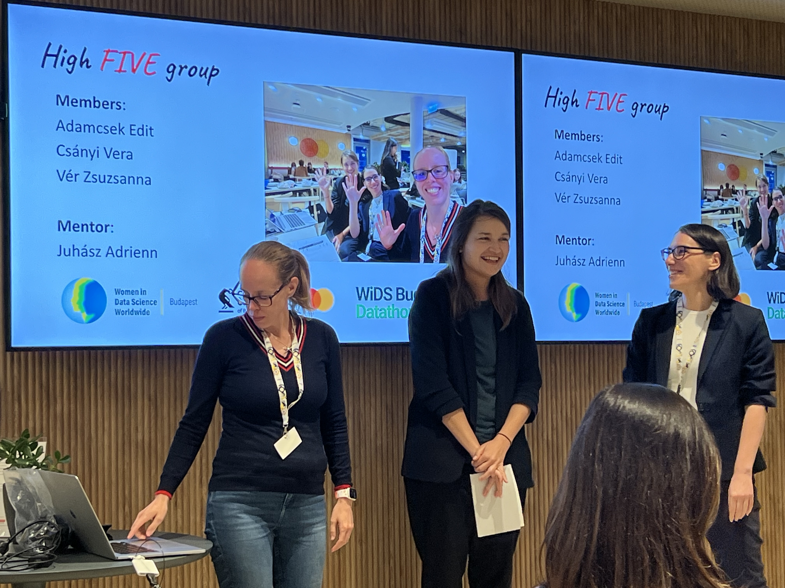
    <figcaption>Uno de los momentos de presentación que le dio ritmo público a la jornada.</figcaption>
  </figure>
  <figure>
    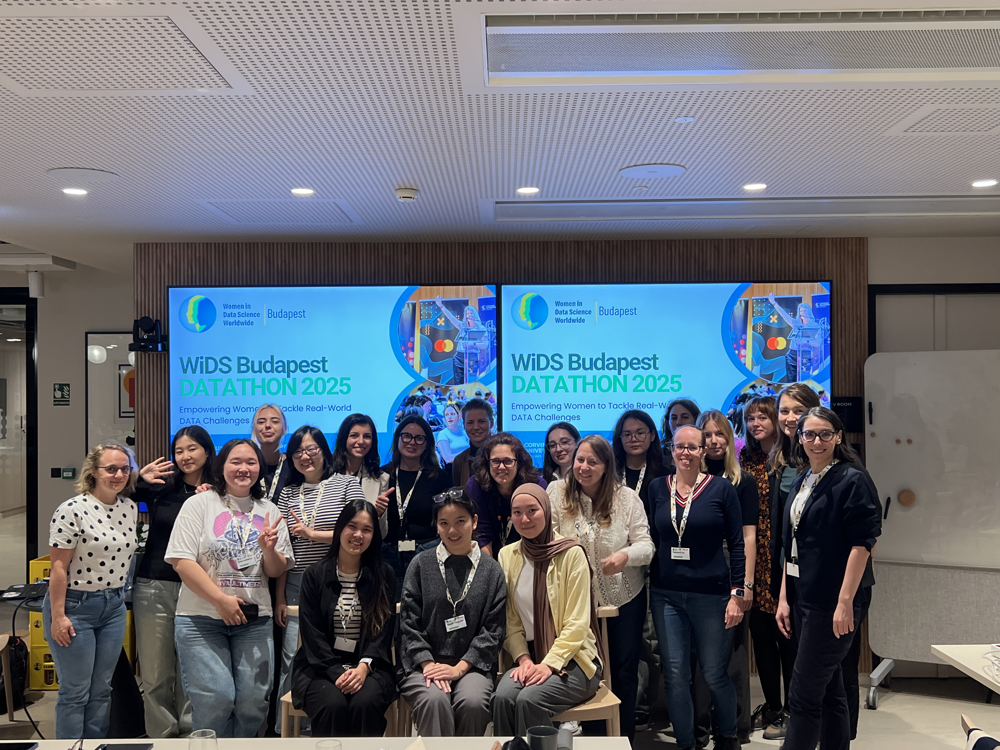
    <figcaption>Otro momento colectivo del evento.</figcaption>
  </figure>
  <figure>
    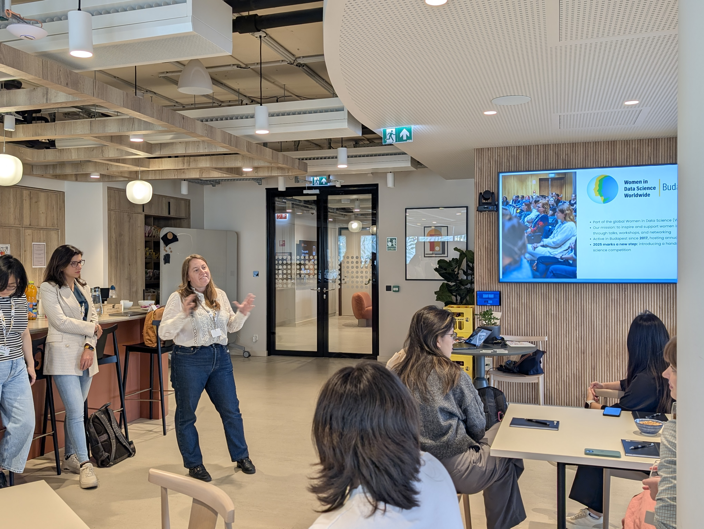
    <figcaption>Una de las sesiones de trabajo práctico durante el datathon.</figcaption>
  </figure>
  <figure>
    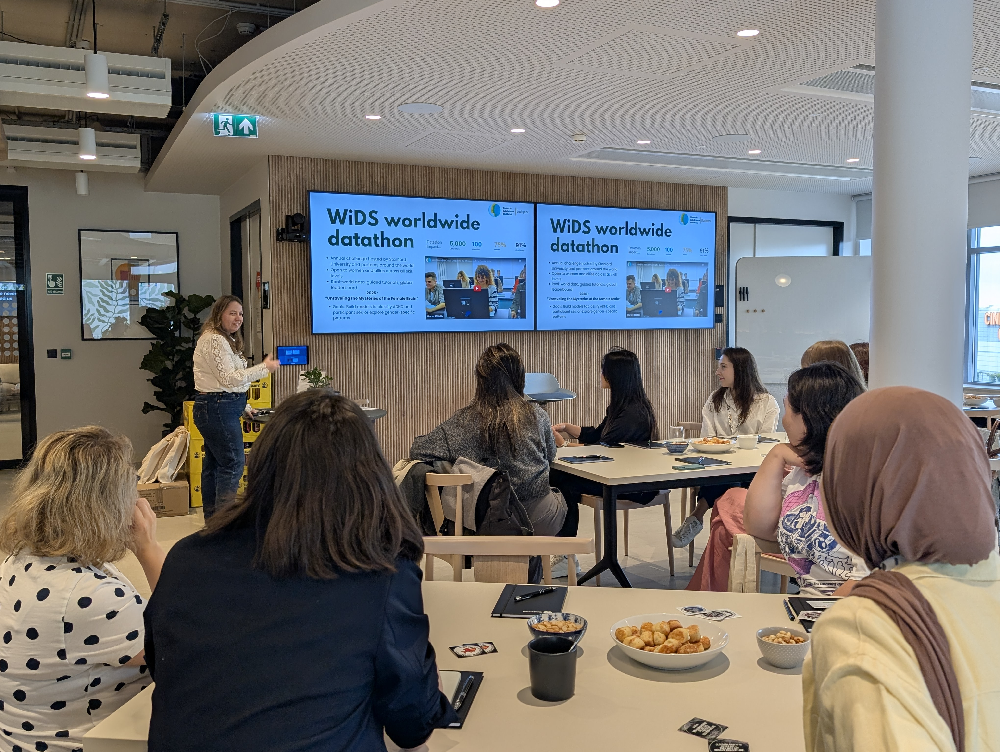
    <figcaption>Una vista más amplia de la sala, las pantallas y el ritmo del día.</figcaption>
  </figure>
  <figure>
    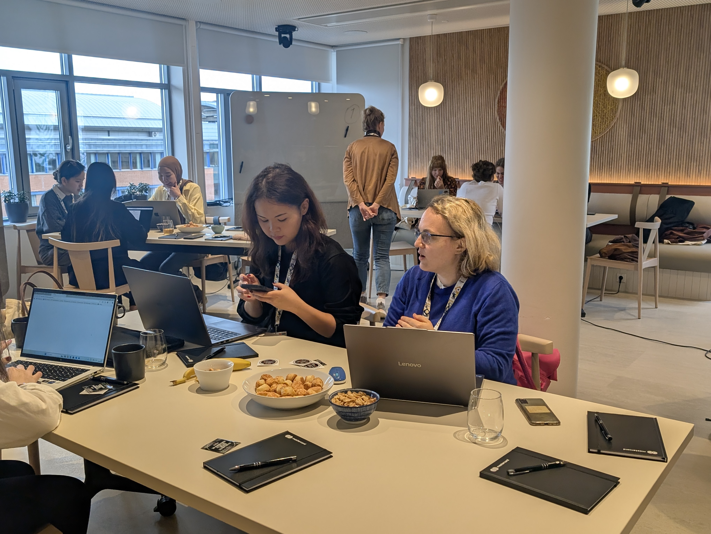
    <figcaption>Exactamente el tipo de trabajo en equipo y apoyo de mentoría que esperaba que el evento hiciera posible.</figcaption>
  </figure>
  <figure>
    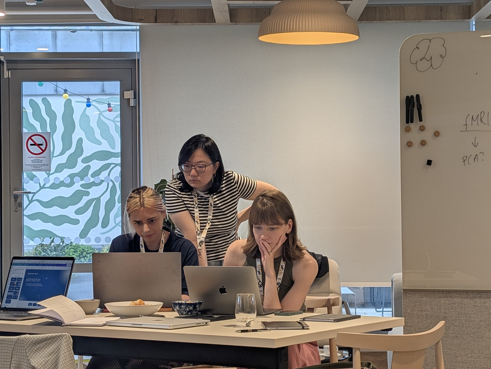
    <figcaption>Mentoría en la práctica, no como eslogan sino como parte de la estructura del evento.</figcaption>
  </figure>
  <figure>
    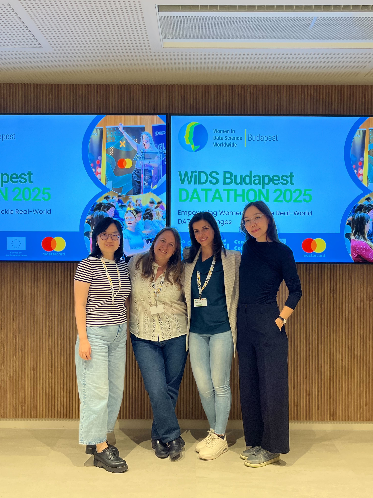
    <figcaption>Un momento de cierre de una jornada que me enorgullece de verdad haber ayudado a organizar.</figcaption>
  </figure>

Al mirar estas imágenes hacia atrás, lo que más destaca no es solo la escala del evento, sino su atmósfera. Se sentía colaborativa, enfocada y abierta. Justamente por eso quiero documentar con más intención eventos como este en el sitio: muestran el tipo de trabajo que hago en ese punto intermedio entre investigación, docencia, mentoría y construcción de comunidad.
