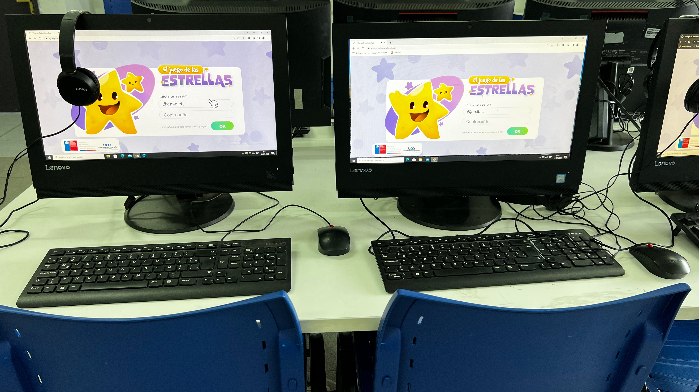

## Research question
How does neurodevelopmental diversity relate to classroom social integration and reciprocal interactions?

## Published in
Scientific Reports, 2025.

## Journal link
- [Journal link](https://www.nature.com/articles/s41598-025-24190-6)

## Main contribution
The study examines social network structure and reciprocity patterns in elementary classrooms, focusing on inclusion dynamics.

## Reproducibility
- Data sharing: ethics-sensitive
- Code/materials: pending release details

## Storytelling (Closeread prototype)

::: {.cr-section}

::: {#cr-autism-figure}

:::

::: {focus-on="cr-autism-figure"}
### Step 1. Why this paper

Inclusion in classrooms depends not only on attendance but on social interaction patterns between peers.
:::

::: {focus-on="cr-autism-figure"}
### Step 2. Network lens

We study how students are socially integrated and how reciprocity differs across social profiles.
:::

::: {focus-on="cr-autism-figure"}
### Step 3. Empirical signal

The paper documents systematic differences in integration and reciprocal ties, which matter for learning environments.
:::

::: {focus-on="cr-autism-figure"}
### Step 4. Why it matters

Results can guide practical interventions for more inclusive classrooms and peer support structures.
:::

:::
